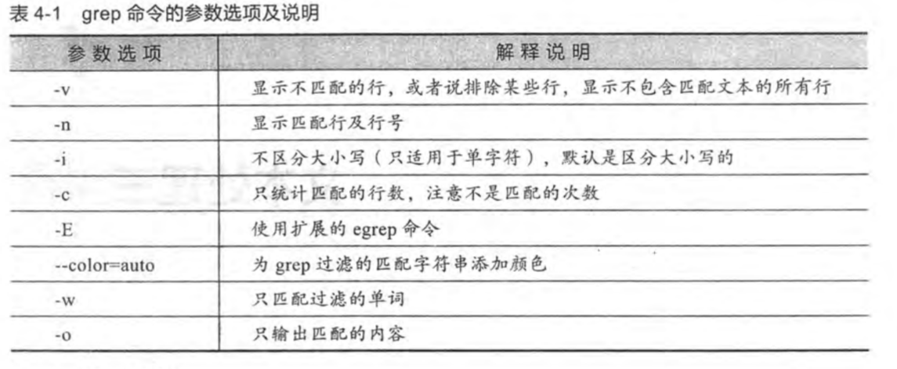

# grep: 文本过滤工具


## 命令详解

【命令星级】 ⭐⭐⭐⭐⭐


【功能说明】 

- 从文本文件或者管道数据中，筛选匹配的行及数据，配合正则一起使用，功能更加强大。


## 语法格式

```shell
grep  [options]   [pattern]  [file]
#	   参数         匹配模式    文件
```




## 示例


### 示例一： **-v** 不包含指定字符的行

```shell
 # 不包含指定字符
 grep -v "#" agent.yml 
```

### 示例二： **-n **显示过滤内容及行号

```sh
[cdyf@cdyf153 config.d]$ grep -n "#" agent.yml 
1:#========================== 全局配置 =============================
2:#: Agent HTTP Address, host:port or :port
6:  #-------------------------------- 配置管理的全局配置 --------------------------------
8:    # KOCA AMO server
9:    # {scheme}://{host}:{port}{context path}，包含 context path
11:    # Pull 时间间隔
13:    # Pull 超时时间
18:  #-------------------------------- Filebeat 日志采集配置 --------------------------------
22:      # 可选，主机IP，默认自动获取主机IP
26:    # out_file: 配置文件
27:    # server: 拉取配置的服务端地址，覆盖Global，可选
28:    # interval: 拉取时间间隔，覆盖Global，可选
29:    # pull_path: 拉取配置接口
30:    # push_path: 接受推送配置接口
31:    # reload: 配置重新加载，可选，支持 http 和 exec 两种方式
37:    # Linux / OSX 主机监控
39:      #metrics_path_prefix: node
43:        #- "--collector.disable-defaults"
45:    # 进程监控
47:      #metrics_path_prefix: process
```


### 示例三： -i 不区分大消息


```shell
# 过滤不区分大小写
rep -i "alex" agent.yml 
# 同时顾虑两次字符串
grep -Ei "alex|test" agent.yml 
```


### 示例四： -c 计算数量


```shell
[cdyf@cdyf153 config.d]$ grep "process" agent.yml 
    - name: process
      #metrics_path_prefix: process
        - "--config.path=config.d/exporter/process/config.yaml"
[cdyf@cdyf153 config.d]$ grep -c "process" agent.yml 
3

```


### 示例五： -w搜索符合要求的字符串

```shell
[root@cdyf153 config.d]# grep -w "cdyf" /etc/passwd
cdyf:x:1000:1000::/home/cdyf:/bin/bash
```


## 生产实例

### 实例一：去掉nginx配置中空行和注释 -Ev

```shell
[root@cdyf153 conf.d]# grep -Ev "^$|#" ace-web-micro.conf 
server {
	server_name localhost;
	listen 5001; 
	location /{
		root /opt/web/ace-web-micro/dist;
		index  index.html index.html;

		autoindex on;
		autoindex_exact_size on;
		autoindex_localtime on;
	}
	location ~ /(admin/|admin-kace/|dashboard/|studio/|config/|auth/|singleLogin/|fileUpDown/|upload/) {
	proxy_pass   http://192.168.8.153:8080;
		proxy_set_header Host $host:$server_port;
		proxy_redirect  off;
		proxy_set_header  X-Real-IP $remote_addr;
		proxy_set_header  X-Forwarded-For $proxy_add_x_forwarded_for;
	}
	error_page   404  /404.html;
	location = /404.html {
		root   /etc/nginx/conf.d/error/;
	}
	location = /404.png {
		root   /etc/nginx/conf.d/error/;
	}
}

```


## 实例二：去掉nginx配置中空行和注释 -Ev

