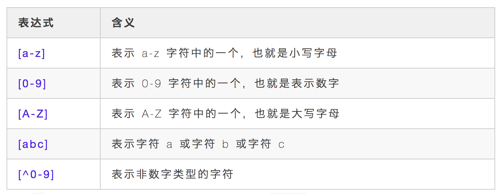

# 上古神器 sed 教程详解，小白也能看得懂


## 介绍


熟悉 Linux 的同学一定知道大名鼎鼎的 Linux 三剑客，它们是 `grep`、`awk`、`sed`，我们今天要聊的主角就是 `sed`。


sed 全名叫 `stream editor`，流编辑器，用程序的方式来编辑文本，与 vim 的交互式编辑方式截然不同。它的功能十分强大，加上正则表达式的支持，可以进行大量的复杂文本的编辑操作。


实际上 sed 提供的功能非常复杂，有专门的书籍讲解它。本文不会讲 sed 的全部东西，只会从 sed 的工作原理、常见使用方法等方面进行说明和讲解，同时也会给出大量的实践用例来帮助更好的理解 sed 基本用法。文中的知识点真正掌握后，足以应付平时工作中的基本需求。

它有自己的使用场景：

- 自动化程序中，不适合交互方式编辑的；
- 大批量重复性的编辑需求；
- 编辑命令太过复杂，在交互文本编辑器难以输入的情况；


## 工作原理


sed 作为一种非交互式编辑器，它使用预先设定好的编辑指令对输入的文本进行编辑，完成之后输出编辑结果。

简单描述 sed 工作原理：

- sed 从输入文件中读取内容，每次处理一行内容，并把当前的一行内容存储在临时的缓冲区中，称为 `模式空间`。
- 接着用 sed 命令处理缓存区中的内容；
- 处理完毕后，把缓存区的内容送往屏幕；
- 接着处理下一行；


这样不断重复，直到文件末尾，文件内容并没有改变，除非你使用重定向输出或指定了 `i` 参数


## 正则表达式


sed 基本上就是在玩正则表达式模式匹配，所以，会玩 sed 的人，正则表达式能力一般都比较强。正则表达式内容相对较多，本节不会重点讲解正则表达式。

为了能够让大部分朋友比较轻松地学习本文知识，这里还是简单介绍下正则表达式的基本内容。如果是专门做正则编程开发的，可以去买本正则的书籍来看。


**（一）基本正则表达式**


- `.`，表示匹配任意一个字符，除了换行符，类似 Shell 通配符中的 `?`；
- `*`，表示前边字符有 0 个或多个；
- `.*`，表示任意一个字符有 0 个或多个，也就是能匹配任意的字符；
- `^`，表示行首，也就是每一行的开始位置，`^abc` 匹配以 abc 开头的字符串；
- `$`，表示行尾，也就是每一行的结尾位置，`}$` 匹配以大括号结尾的字符串；
- `{}`，表示前边字符的数量范围，`{2}`，表示重复 2 次，`{2,}`重复至少 2 次，`{2,4}` 重复 2-4 次；
- `[]`，括号中可以包含表示字符集的表达式，使用方法大概如下几种





**（二）扩展正则表达式**


扩展正则表达式使用频率上没有基本表达式那么高，但依然很重要，很多情况下没有扩展正则是搞不定的，sed 命令使用扩展正则时需要加上选项 `-r`。


- `?`：表示前置字符有 0 个或 1 个；
- `+`：表示前置字符有 1 个或多个；
- `|`：表示匹配其中的一项即可；
- `()`：表示分组，`(a|b)b` 表示可以匹配 ab 或 bb 子串，且命令表达式中可以通过 `\1`、`\2` 来表示匹配的变量
- `{}`：和基本正则中的大括号中意义相同，只不过使用时不用加 转义符号；


## 基本语法


先介绍下 sed 的基本语法。


```shell
sed [选项] 'command' filename
```


选项部分，常见选项包括：`-n`、`-e`、`-i`、`-f`、`-r` 等。


**command** 子命令格式：


```shell
[地址1, 地址2] [函数] [参数(标记)]
```


选项简单说明：


- `-n`，表示安静模式。默认 sed 会把每行内容处理完毕后打印到屏幕上，加上选项后就不会输出到屏幕上。
- `-e`，如果需要用 sed 对文本内容进行多种操作，则需要执行多条子命令来进行操作；
- `-i`，默认 sed 只会处理模式空间的副本内容，不会直接修改文件，如果需要修改文件，就要指定 `-i` 选项；
- `-f`，如果命令操作比较多时，用 `-e` 会有点力不从心，这时需要把多个子命令写入脚本文件，使用 `-f` 选项指定执行该脚本；
- `-r`：如果需要支持扩展正则表达式，那么需要添加 `-r` 选项；


## 数字定址和正则定址


默认情况下 sed 会对每一行内容进行匹配、处理、输出，有时候我们不需要对所有内容进行操作，只需要修改一种一部分，比如 1-10 行，偶数行，或包括 hello 字符串的行。

这种情况下，就需要我们去定位特定的行来进行处理，而不是全部内容，这里把定位指定的行叫做 **定址**。


**（一）数字定址**


数字定址其实就是通过数字去指定要操作的行，有几种方式，每种方式都有不同的应用场景。


```shell
# 只将第4行中hello替换为A
$ sed '4s/hello/A/g' file.txt
# 将第2-4行中hello替换为A
$ sed '2,4s/hello/A/g' file.txt
# 从第2行开始，往下数4行，也就是2-6行
$ sed '2,+4s/hello/A/g' file.txt
# 将最后1行中hello替换为A
$ sed '$s/hello/A/g' file.txt
# 除了第1行，其它行将hello替换为A
$ sed '1!s/hello/A/g' file.txt
```


**（二）正则定址**


正则定址，是通过正则表达式的匹配来确定需要处理编辑哪些行，其它行就不需要处理


```shell
# 将匹配到hello的行执行删除操作，d 表示删除
$ sed '/hello/d' file.txt
# 删除空行，"^$" 表示空行
$ sed '/^$/d' file.txt
# 将匹配到以ts开头的行到以te开头的行之间所有行进行删除
$ sed '/^ts/,/^te/d' file.txt
```


**（三）数字定址和正则定址混用**


数字定址和正则定址可以配合使用


```shell
# 匹配从第1行到ts开头的行，把匹配的行执行删除
$ sed '1,/^ts/d' file.txt
```


## 基本子命令


**（一）替换子命令 s**


子命令 `s` 为替换子命令，是平时 sed 使用最多的命令，因为支持正则表达式，功能很强大，基本可以替代 `grep` 的基本用法。


基本语法：


```shell
[address]s/pat/rep/flags
```


替换子命令基本用法

```shell
# 将每行的hello替换为HELLO，只替换匹配到的第一个
$ sed 's/hello/HELLO/' file.txt

# 将匹配到的hello全部替换为HELLO，g表示替换一行所有匹配到的
$ sed 's/hello/HELLO/g' file.txt

# 将第2次匹配到的hello替换
$ sed 's/hello/A/2' file.txt

# 将第2次后匹配到的所有都替换
$ sed 's/hello/A/2g' file.txt

# 在行首加#号
$ sed 's/^/#/g' file.txt

# 在行尾加东西
$ sed 's/$/xxx/g' file.txt
```


正则表达式的简单使用


```shell
# 使用扩展正则表达式，结果为：A
$ echo "hello 123 world" | sed -r 's/[a-z]+ [0-9]+ [a-z]+/A/'

# <b>This</b> is what <span style="x">I</span> meant
# 要求：去掉上述html文件中的tags
$ sed 's/<[^>]*>//g' file.txt
```


多个匹配


```
# 将1-3行的my替换为your，且3行以后的This替换为That$ sed '1,3s/my/your/g; 3,$s/This/That/g' my.txt
# 等价于$ sed -e '1,3s/my/your/g' -e '3,$s/This/That/g' my.txt
```

复制代码


使用匹配到的变量


```
# 将匹配到的字符串前后加双引号，结果为：My "name" chopin# "&"表示匹配到的整个结果集$ echo "My name chopin" | sed 's/name/"&"/'
# 如下命令，结果为：hello=world，"\1"和"\2"表示圆括号匹配到的值$ echo "hello,123,world" | sed 's/\([^,]\),.*,\(.*\)/\1=\2/'
```

复制代码


其它几个常见用法


```
# 只将修改匹配到行内容打印出来，-n关闭了模式空间的打印模式$ sed -n 's/i/A/p' file.txt
# 替换是忽略大小写，将大小写i替换为A$ sed -n 's/i/A/i' file.txt
# 将替换后的内容另存为一个文件$ sed -n 's/i/A/w b.txt' file.txt$ sed -n 's/i/A/' file.txt > b.txt
```

复制代码


注意，sed 修改匹配到的内容后，默认行为是不保存到原文件，直接输出修改后模式空间的内容，如果要修改原文件需要指定 `-i` 选项。


**（二）追加行子命令 a**


子命令 `a` 表示在指定行下边插入指定的内容行；


```shell
# 将所有行下边都添加一行内容A
$ sed 'a A' file.txt
# 将文件中1-2行下边都添加一行内容A
$ sed '1,2a A' file.txt
```

复制代码


**（三）插入行子命令 i**


子命令 `i` 和 `a` 使用基本一样，只不过是在指定行上边插入指定的内容行


```shell
# 将文件中1-2行上边都添加一行内容A
$ sed '1,2i A'
```

复制代码


**（四）替换行子命令 c**


子命令 `c` 是表示把指定的行内容替换为自己需要的行内容


```
# 将文件所有行都分别替换为A$ sed 'c A' file.txt
# 将文件中1-2行内容替换为A，注意：两行内容变成了一行A$ sed '1,2c A' file.txt
# 将1-2行内容分别替换为A行内容$ sed '1,2c A\nA' file.txt
```

复制代码


**（五）删除行子命令 d**


子命令 `d` 表示删除指定的内容行，这个很容理解


```
# 将文件中1-3行内容删除$ sed '1,3d' file.txt
# 将文件中This开头的行内容删除$ sed '/^This/d' file.txt
```

复制代码


**（六）设置行号子命令=**


子命令 `=`，可以将行号打印出来


```
# 将指定行上边显示行号$ sed '1,2=' file.txt
# 可以将行号设置在行首$ sed '=' file.txt | sed 'N;s/\n/\t/'
```

复制代码


**（七）子命令 N**


子命令 `N`，把下一行内容纳入当缓存区做匹配，注意的是第一行的 `\n` 仍然保留


其实就是当前行的下一行内容也读进缓存区，一起做匹配和修改，举个例子吧


```
# 将偶数行内容合并到奇数行$ sed 'N;s/\n//' file.txt
```

复制代码


哈哈，是不是很简单？


## 实战练习


掌握了上边的基础命令操作后，基本上可以满足平时 `95%` 的需求啦。sed 还有一些高级概念，比如：模式空间、保持空间、高级子命令、分支和测试等，平时使用概率非常小，本文就暂不讲解了，有需要的同学可以私信我一起交流学习哈。


学习了这么多基础用法后，只要你勤加练习，多实践，多使用，一定可以得心应手，极大提高的文本处理效率。下边我简单再给出一些比较实用的操作实践，希望对大家有帮助。


*1.* 删除文件每行的第二个字符


```shell
$ sed -r 's/(.)(.)(.*)$/\1\3/' file.txt
```


*2.* 交换每行的第一个字符和第二个字符


```shell
$ sed -r ‘s/(.)(.)(.*)/\2\1\3/’ file.txt
```


*3.* 删除文件中所有的数字


```shell
$ sed 's/[0-9]//g' file.txt
```


*4.* 用制表符替换文件中出现的所有空格


```shell
$ sed -r 's/ +/\t/g' file.txt
```


*5.* 把所有大写字母用括号**()**括起来


```shell
$ sed -r 's/([A-Z])/(\1)/g'
```


*6.* 隔行删除


```shell
$ sed '0~2{d}' file.txt
```


*7.* 删除所有空白行


```shell
$ sed '/^$/d' file.txt
```


好了，以上是 sed 命令常用的全部内容。想要熟练掌握，只有多实践，多练习正则表达式的使用，一旦熟练掌握后，相信在日后工作中一定会产生巨大作用的。