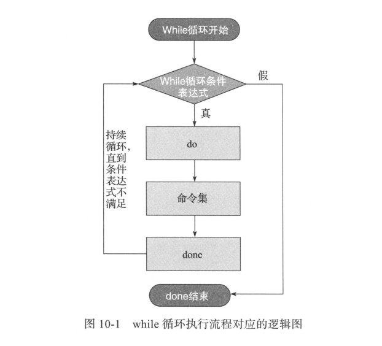

# 10.1 当型和直到型循环语法


## 10.1.1 while循环语法


```shell
while <条件表达式>
do
	指令...
done
```


- 条件成立执行，do中内容，不成立退出




## 10.1.2 until循环语句


语法为

```shell
until <条件表达式>
do
	指令...
done
```


- 与while语法类似，区别是until是条件不成立的时候，进入循环体执行命令。
- 条件成立的时候退出循环。（了解即可）