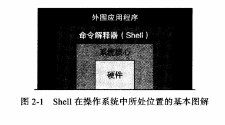
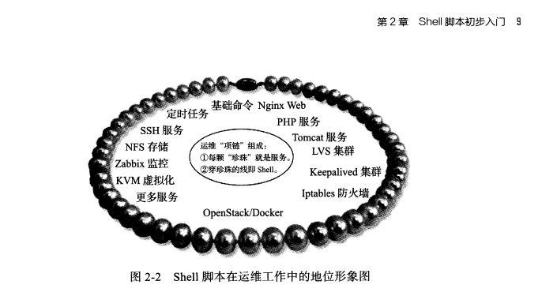
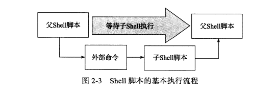

# 2.Shell脚本初步入门


## 2.1 什么是shell

（1）Shell是一个命令解释器，解释并执行用户输入的命令及程序等。

（2）shell存在于操作系统的最外层，直接用用户对话，把用户输入解释给操作系统，并处理各种操作系统输出的结果。




## 2.2 什么是Shell脚本


**定义**：命令语句不在命令中执行，通过程序文件执行时，这个程序叫做shell。后缀为.sh


```shell
#!/bin/bash
# author: wuzhibin
# 清理系统日志：/var/log/message

LOG_DIR=/var/log
ROOT_UID=0

# 判断UID是不是root的UID
if [ "${UID}" -ne "${ROOT_UID}" ]
    then
        echo "Must be root to run this script."
        exit 1
fi

# 切换到目录，判断目录 /dev/null 代表空设备文件，它等价于一个仅仅写文件，全部写入它的内容都会永远丢失。而尝试从它那儿读取内容则什么也读不到。
cd $LOG_DIR ||{
    echo "Can not change nessassary dirctory"
    exit 1
}

# 清理日志
cat /dev/null>messages &&{
    echo "Log clean up sucess"
    exit 0
}
echo "Log clean up failed"
exit 1
```


## 2.3 Shell脚本在linux运维工作的地位

（1）shell脚本适合用于处理纯文本类型数据：启动脚本，日志文件等。



## 2.4 脚本语言的种类


### 2.4.1 Shell脚本的种类

Shell脚本语言是弱类型语言（无需要定义变量类型即可使用）

#### 分类

- Cshell

- Bourne shell

#### 现在使用

主流shell 为bash，由Bourne shell发展而来。

```shell
# 查看系统的shell
[root@cdyf138 ~]# cat /etc/shells
/bin/sh
/bin/bash
/usr/bin/sh
/usr/bin/bash
```


### 2.4.2 其他常用脚本语言

- PHP
- Python
- Perl


### 2.4.3 Shell语言的优势

（1）处理偏操作系统底层的业务。

（2）开发简单，运维简单，易用，高效三大原则。

（3）Python语言的优势是开发较为负载的运维工具软件、web界面管理工具。


## 2.5 常见操作系统默认的Shell

（1）查询方法

**方法一：**

```shell
[root@cdyf138 ~]# echo $SHELL
/bin/bash
```

**方法二：**

```shell
[root@cdyf138 ~]# grep root /etc/passwd
root:x:0:0:root:/root:/bin/bash
operator:x:11:0:operator:/root:/sbin/nologin
```


## 2.6 Shell脚本的建立和执行


### 2.6.1 shell脚本建立

推荐使用自带的vim来编写，可以事先做一个别名   **alias vi='vim'**方法如下

```shell
[root@cdyf138 ~]# echo "alias vi='vim'">>/etc/profile
[root@cdyf138 ~]# tail -1 /etc/profile
alias vi='vim'
```

#### 1.脚本开头

```shell
#!/bin/bash 或者 #!/bin/sh
```

这里开通的`#！`，在执行的时候内核会根据 #！后的解释器来确定哪个程序执行脚本。

#### 2.bash和sh的区别

- sh 为bash的软连接，大多数情况下，脚本使用哪个解释器没区别，更加规范的是用**#!/bin/bash**

```shell
[root@cdyf138 ~]# ll /bin/sh
lrwxrwxrwx. 1 root root 4 Sep 25 17:29 /bin/sh -> bash
```

- 很多系统自带脚本开头

```shell
[root@cdyf138 ~]# head -1 /etc/init.d/network
#! /bin/bash
```


- 查看bash版本号

```shell
[root@cdyf138 ~]# cat /etc/redhat-release
CentOS Linux release 7.8.2003 (Core)
[root@cdyf138 ~]# bash --version
GNU bash, version 4.2.46(2)-release (x86_64-redhat-linux-gnu)
Copyright (C) 2011 Free Software Foundation, Inc.
License GPLv3+: GNU GPL version 3 or later <http://gnu.org/licenses/gpl.html>

This is free software; you are free to change and redistribute it.
There is NO WARRANTY, to the extent permitted by law.
```

-  升级方法

```shell
yum -y update bash
rpm -qa bash
```

- 执行shell脚本

```shell
bash test.sh
```


#### 3.脚本注释

注释尽量不要用中文，脚本中也不要用中文

```shell
# 注释
```


### 2.6.2 shell脚本执行


#### 1. 执行顺序

（1）先找系统变量ENV，变量环境变量文件加载顺序**/etc/profile、~/.bash_profile、~/.bashrc、/etc/bashrc.**

（2）执行脚本中的内容。

（3）Shell脚本从上往下，从左到右依次执行每一行的命令语句，执行完了一个命令才执行下一个。

（4）脚本有有嵌套，就会先执行子脚本的内容，完成后，返回父脚本继续执行。

（5）通常情况下，执行Shell的时候，会向系统请求启动一个新的进程，以便执行命令及子脚本。



**注意：**在定时任务 crond时，最好在脚本中重新定义系统变量，否则不会加载。


#### 2.执行方法

（1）**推荐使用 bash  test.sh  或者sh test.sh**

（2）./test.sh或者path/test.sh

（3）source test.sh


### 2.6.3 Shell脚本开发的基本规范和习惯

（1）第一行必须是 **#!/bin/bash** 或者**#!/bin/sh**

（2）Shell脚本开头加版本号，版权信息。

```shell
#!/bin/bash
# Date: 2020-12-30
# Author: wuzb
# Blog: http:///com
# Description: test
# Version:1.1
```

（3）shell中尽量不要使用中文（不限于注释）

（4）shell中脚本扩展名为.sh

（5）脚本应该放在固定路径。

​    1）成对符号一次性写出来，防止遗漏  如 []  ""

​    2）中括号两端 至少要有一个空格。[]

​    3）对于流程控制预警，应该一次性将格式写完再添加内容。

​    4）通过缩进让代码更易读。

​    5）对于常规变量的字符串定义变量值要加双引号，且等号前后不能有空格。

​    6）脚本中单引号，双引号及反引号必须为中文状态的字符。

