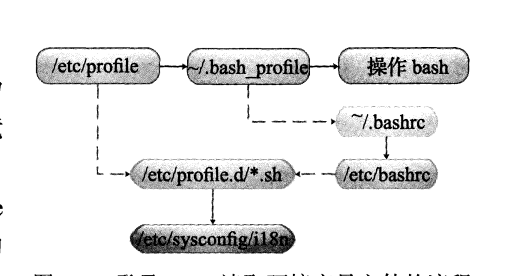
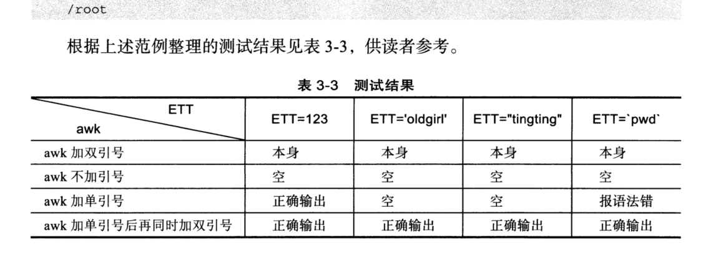

# 3.Shell变量的核心基础知识与实践


## 3.1 什么是shell变量


#### 1.什么是变量

变量就是一个固定的字符串代替更多更复杂的内容，且被重复利用。

- 变量赋值方式：变量名=value

#### 2.shell变量特性

（1）shell不需要指定变量类型，属于弱类型语言。

（2）可以用declare指定变量类型。

#### 3.变量类型

**环境变量（全局变量）**：自定义环境变量和bash内置环境变量

**普通变量（局部变量）**：创建shell脚本中定义的变量。


## 3.2 环境变量

一般指用export内置命令导出的变量，用于定义shell的运行环境。

> 环境变量均使用大写表示

- set：**显示所有变量**
- env：**只显示全局变量**
- declare：所有变量，函数，整数及已经导出的变量。

量环境变量文件加载顺序**/etc/profile、~/.bash_profile、~/.bashrc、/etc/bashrc.**

```shell
[root@cdyf138 ~]# env
XDG_SESSION_ID=242
HOSTNAME=cdyf138.szkingdom.com
TERM=xterm-256color
SHELL=/bin/bash
HISTSIZE=1000
SSH_CLIENT=192.168.8.56 50979 22
SSH_TTY=/dev/pts/0
USER=root
LS_COLORS=rs=0:di=38;5;27:ln=38;5;51:mh=44;38;5;15:pi=40;38;5;11:so=38;5;13:do=38;5;5:bd=48;5;232;38;5;11:cd=48;5;232;38;5;3:or=48;5;232;38;5;9:mi=05;48;5;232;38;5;15:su=48;5;196;38;5;15:sg=48;5;11;38;5;16:ca=48;5;196;38;5;226:tw=48;5;10;38;5;16:ow=48;5;10;38;5;21:st=48;5;21;38;5;15:ex=38;5;34:*.tar=38;5;9:*.tgz=38;5;9:*.arc=38;5;9:*.arj=38;5;9:*.taz=38;5;9:*.lha=38;5;9:*.lz4=38;5;9:*.lzh=38;5;9:*.lzma=38;5;9:*.tlz=38;5;9:*.txz=38;5;9:*.tzo=38;5;9:*.t7z=38;5;9:*.zip=38;5;9:*.z=38;5;9:*.Z=38;5;9:*.dz=38;5;9:*.gz=38;5;9:*.lrz=38;5;9:*.lz=38;5;9:*.lzo=38;5;9:*.xz=38;5;9:*.bz2=38;5;9:*.bz=38;5;9:*.tbz=38;5;9:*.tbz2=38;5;9:*.tz=38;5;9:*.deb=38;5;9:*.rpm=38;5;9:*.jar=38;5;9:*.war=38;5;9:*.ear=38;5;9:*.sar=38;5;9:*.rar=38;5;9:*.alz=38;5;9:*.ace=38;5;9:*.zoo=38;5;9:*.cpio=38;5;9:*.7z=38;5;9:*.rz=38;5;9:*.cab=38;5;9:*.jpg=38;5;13:*.jpeg=38;5;13:*.gif=38;5;13:*.bmp=38;5;13:*.pbm=38;5;13:*.pgm=38;5;13:*.ppm=38;5;13:*.tga=38;5;13:*.xbm=38;5;13:*.xpm=38;5;13:*.tif=38;5;13:*.tiff=38;5;13:*.png=38;5;13:*.svg=38;5;13:*.svgz=38;5;13:*.mng=38;5;13:*.pcx=38;5;13:*.mov=38;5;13:*.mpg=38;5;13:*.mpeg=38;5;13:*.m2v=38;5;13:*.mkv=38;5;13:*.webm=38;5;13:*.ogm=38;5;13:*.mp4=38;5;13:*.m4v=38;5;13:*.mp4v=38;5;13:*.vob=38;5;13:*.qt=38;5;13:*.nuv=38;5;13:*.wmv=38;5;13:*.asf=38;5;13:*.rm=38;5;13:*.rmvb=38;5;13:*.flc=38;5;13:*.avi=38;5;13:*.fli=38;5;13:*.flv=38;5;13:*.gl=38;5;13:*.dl=38;5;13:*.xcf=38;5;13:*.xwd=38;5;13:*.yuv=38;5;13:*.cgm=38;5;13:*.emf=38;5;13:*.axv=38;5;13:*.anx=38;5;13:*.ogv=38;5;13:*.ogx=38;5;13:*.aac=38;5;45:*.au=38;5;45:*.flac=38;5;45:*.mid=38;5;45:*.midi=38;5;45:*.mka=38;5;45:*.mp3=38;5;45:*.mpc=38;5;45:*.ogg=38;5;45:*.ra=38;5;45:*.wav=38;5;45:*.axa=38;5;45:*.oga=38;5;45:*.spx=38;5;45:*.xspf=38;5;45:
MAIL=/var/spool/mail/root
PATH=/usr/local/sbin:/usr/local/bin:/usr/sbin:/usr/bin:/opt/tools/apache-ignite-2.9.0-bin/bin:/root/bin
PWD=/root
LANG=en_US.UTF-8
HISTCONTROL=ignoredups
SHLVL=1
HOME=/root
LOGNAME=root
SSH_CONNECTION=192.168.8.56 50979 192.168.8.138 22
LESSOPEN=||/usr/bin/lesspipe.sh %s
XDG_RUNTIME_DIR=/run/user/0
_=/usr/bin/env
```


```shell
[root@cdyf138 ~]# env
XDG_SESSION_ID=242
HOSTNAME=cdyf138.szkingdom.com
TERM=xterm-256color
SHELL=/bin/bash
HISTSIZE=1000
SSH_CLIENT=192.168.8.56 50979 22
SSH_TTY=/dev/pts/0
USER=root
LS_COLORS=rs=0:di=38;5;27:ln=38;5;51:mh=44;38;5;15:pi=40;38;5;11:so=38;5;13:do=38;5;5:bd=48;5;232;38;5;11:cd=48;5;232;38;5;3:or=48;5;232;38;5;9:mi=05;48;5;232;38;5;15:su=48;5;196;38;5;15:sg=48;5;11;38;5;16:ca=48;5;196;38;5;226:tw=48;5;10;38;5;16:ow=48;5;10;38;5;21:st=48;5;21;38;5;15:ex=38;5;34:*.tar=38;5;9:*.tgz=38;5;9:*.arc=38;5;9:*.arj=38;5;9:*.taz=38;5;9:*.lha=38;5;9:*.lz4=38;5;9:*.lzh=38;5;9:*.lzma=38;5;9:*.tlz=38;5;9:*.txz=38;5;9:*.tzo=38;5;9:*.t7z=38;5;9:*.zip=38;5;9:*.z=38;5;9:*.Z=38;5;9:*.dz=38;5;9:*.gz=38;5;9:*.lrz=38;5;9:*.lz=38;5;9:*.lzo=38;5;9:*.xz=38;5;9:*.bz2=38;5;9:*.bz=38;5;9:*.tbz=38;5;9:*.tbz2=38;5;9:*.tz=38;5;9:*.deb=38;5;9:*.rpm=38;5;9:*.jar=38;5;9:*.war=38;5;9:*.ear=38;5;9:*.sar=38;5;9:*.rar=38;5;9:*.alz=38;5;9:*.ace=38;5;9:*.zoo=38;5;9:*.cpio=38;5;9:*.7z=38;5;9:*.rz=38;5;9:*.cab=38;5;9:*.jpg=38;5;13:*.jpeg=38;5;13:*.gif=38;5;13:*.bmp=38;5;13:*.pbm=38;5;13:*.pgm=38;5;13:*.ppm=38;5;13:*.tga=38;5;13:*.xbm=38;5;13:*.xpm=38;5;13:*.tif=38;5;13:*.tiff=38;5;13:*.png=38;5;13:*.svg=38;5;13:*.svgz=38;5;13:*.mng=38;5;13:*.pcx=38;5;13:*.mov=38;5;13:*.mpg=38;5;13:*.mpeg=38;5;13:*.m2v=38;5;13:*.mkv=38;5;13:*.webm=38;5;13:*.ogm=38;5;13:*.mp4=38;5;13:*.m4v=38;5;13:*.mp4v=38;5;13:*.vob=38;5;13:*.qt=38;5;13:*.nuv=38;5;13:*.wmv=38;5;13:*.asf=38;5;13:*.rm=38;5;13:*.rmvb=38;5;13:*.flc=38;5;13:*.avi=38;5;13:*.fli=38;5;13:*.flv=38;5;13:*.gl=38;5;13:*.dl=38;5;13:*.xcf=38;5;13:*.xwd=38;5;13:*.yuv=38;5;13:*.cgm=38;5;13:*.emf=38;5;13:*.axv=38;5;13:*.anx=38;5;13:*.ogv=38;5;13:*.ogx=38;5;13:*.aac=38;5;45:*.au=38;5;45:*.flac=38;5;45:*.mid=38;5;45:*.midi=38;5;45:*.mka=38;5;45:*.mp3=38;5;45:*.mpc=38;5;45:*.ogg=38;5;45:*.ra=38;5;45:*.wav=38;5;45:*.axa=38;5;45:*.oga=38;5;45:*.spx=38;5;45:*.xspf=38;5;45:
MAIL=/var/spool/mail/root
PATH=/usr/local/sbin:/usr/local/bin:/usr/sbin:/usr/bin:/opt/tools/apache-ignite-2.9.0-bin/bin:/root/bin
PWD=/root
LANG=en_US.UTF-8
HISTCONTROL=ignoredups
SHLVL=1
HOME=/root
LOGNAME=root
SSH_CONNECTION=192.168.8.56 50979 192.168.8.138 22
LESSOPEN=||/usr/bin/lesspipe.sh %s
XDG_RUNTIME_DIR=/run/user/0
_=/usr/bin/env
```


### 3.2.1 自定义环境变量

（1）export  变量名=value

（2）变量名=value;   export 变量名

（3）declare  -x 变量名=value

```shell
# 方法1
export NAME=oldboy

# 方法2
NAME=oldboy
export NAME

# 方法3
declare -x NAME=oldboy
```

#### 1. 用户环境变量文件

用户家目录下的：**bashrc，bash_profile**

```shell
/root/.bashrc 
/root/.bash_profile
```


#### 2.全局环境变量配置

- 使用：/etc/profile，**/etc/bashrc**，/etc/profile.d

- 推荐使用 ：**/etc/bashrc**

- 登录后显示加载内容：**/etc/profile.d/**

#### 3.设置登录提示的两种方法

- 第一种：/etc/motd

```shell
WARNING! The remote SSH server rejected X11 forwarding request.
Last login: Wed Jan 13 16:22:15 2021 from 192.168.8.56
welcome to cdyf centos.
[root@cdyf138 ~]# cat  /etc/motd
welcome to cdyf centos.
```

- 第二种：/etc/profile.d/ 添加一个cdyf.sh

```shell
echo "welcome to cdyf centos."
```

结果

```shell
WARNING! The remote SSH server rejected X11 forwarding request.
Last login: Wed Jan 13 16:27:58 2021 from 192.168.8.56
welcome to cdyf centos.
```


### 3.2.2 显示与取消环境变量

#### 1.通过echo或者printf打印环境变量

```shell
[root@cdyf138 ~]# echo $SHELL
/bin/bash
[root@cdyf138 ~]# printf $PWD\n
/rootn[root@cdyf138 ~]# echo $SHELL
/bin/bash
[root@cdyf138 ~]# printf "$PWD\n"
/root
[root@cdyf138 ~]# echo $USER
root
[root@cdyf138 ~]# echo $HOME
/root
```

> 重要提示：在shell中一般直接可以使用系统默认的环境变量，不需要重新定。但是在定时任务当执行SHELL的时候需要重新定义（系统未加载环境变量到内存中）


#### 2.通过env和set显示默认的环境变量。

#### 3.unset消除本地变量和环境变量

```shell
[root@cdyf138 ~]# echo $USER
root
[root@cdyf138 ~]# unset USER
[root@cdyf138 ~]# echo $USER
```


>环境变量总结
>
>- 变量名通常要大写。
>- 变量可以在自身的Shell及子shell中使用。
>- 通常export来定义环境变量
>- 执行env默认可以显示所有的环境变量及其值。
>- 输出时用"$变量名"，取消时用“unset  变量名”。
>- 书写crond定时任务的时候，脚本用的环境变量最好自己在脚本重新定义。
>- 如果希望环境变量永久生效，则可以将其放在用户环境变量文件或者全局环境变量文件中。


### 3.2.3 环境变量初始化及对应文件生效顺序




默认情况 下，bash会到若干的环境变量文件中查找变量（系统变量文件）。检查变量文件的情况取决于shell的运行方式。

（1）通过系统用登录后默认执行shell

（2）非登录交互式运行shell

（3）执行脚本运行交互式shell

**变量执行优先级**

>  /etc/profile  >  /etc/profile.d/*.sh  >  ~/.bash_profile/  >   ~/.bashrc  > /etc/bashrc


## 3.3 普通变量


### 3.3.1 定义本地变量

#### 1. 普通变量定义

（1） 变量名=value

（2）变量名=‘value’     # 单引号

（3） 变量名=“value”   # 双引号

#### 2.变量名及赋值要求。

- 字母数字和下划线，可以以字母和下划线开头。
- 变量value可以加单引号，双引号但是不能加括号。

#### 3.普通变量的定义及输出

（1）$C ,${C}输出变量

```shell
[root@cdyf138 ~]# name=oldboy
[root@cdyf138 ~]# echo $name
oldboy
[root@cdyf138 ~]# echo ${name}
oldboy
```

#### 4.变量定义技巧总计

- 变量=value：不加任何引号，适合变量值为**连续数字，字符串和路径**。
- 变量名=‘value’ ：单引号，输出变量内容，单引号里面是什么输出什么。
- 变量名=“value” ： 双引号，输出变量中的命令和及变量通过解析后在输出，适合变量中包含命令及 变量的情况。

>经验
>
>- 数据内容，可以不加任何引号。
>- 其他情况，必须加上双引号。
>- 如果想原样输出内容，加单引号。

```shell
a=192.168.1.2-$a
b='192.168.1.2-$a'
c="192.168.1.2-$a"
echo "a=$a"
echo "b=$b"
echo "c=${c}"
```


#### 5.把一个命令的结构作为变量赋值的方法

（1）**test=``ls`**`

（2）test=$(ls)

```shell
[root@cdyf138 ~]# cmd=$(ls)
[root@cdyf138 ~]# echo $cmd
anaconda-ks.cfg gtjazglogs test tools
[root@cdyf138 ~]# cmd=`ls`
[root@cdyf138 ~]# echo $cmd
anaconda-ks.cfg gtjazglogs test tools
```

范例 3-7：按照每天打包网站的站点目录程序，生成不同的文件名。

```shell
[root@cdyf138 ~]# CMD=$(date +%F)
[root@cdyf138 ~]# echo $CMD
2021-01-13
[root@cdyf138 ~]# echo $(date +%F).tar.gz
2021-01-13.tar.gz

```


**局部变量的定义赋值的经验小结**

>（**1）常规变量定义**
>
>- 如变量内容为连续的数字或者字符串，赋值时，变量内容两边可以不加引号，例如 a=123
>
>- 变量内容很多时候，**如果有空格**且希望解析内容中的变量，就加双引号，例如 a="/etc/rc.local $USER",此时输出变量会对内容中的$USER进行解析然后再输出。
>
>- 希望原样输出变量中的内容的时候，就用单引号引起内容进行赋值，例如：a='$USER'
>
>- 使用反引号将赋值的命令括起来，例如：a=``ls``或者,$() 例如：a=$(ls)
>
>（2）变量的输出方法如下。
>
>- 使用“$变量名”
>
>（3）变量定义技巧及注意事项
>
>- 注意命令变量内容前后的字符为反引号，不是单引号。
>- 在变量钱加上$可以取到变量的值，使用echo或printf显示变量的值，如$A或者${A}，写法不一样，但是结果一样
>- echo 等命令输出变量的时候加单引号，双引号，反引号，结果和变量定义一样子。
>- $dbname_tname，变量后面有连续字符，用${dbname}_tname


#### 6.局部变量和全局变量

> 函数内，使用**local   i**的方式来定义
>
> **全局变量使用大写**


### 3.3.2 变量定义及变量输出说明

- 例3-9 过滤字符串加引号

```shell
[root@cdyf138 ~]# OLDBOY=testchars
[root@cdyf138 ~]# cat grep.log
testchars
oldboy
[root@cdyf138 ~]# grep "$OLDBOY" grep.log
testchars
[root@cdyf138 ~]# grep '$OLDBOY' grep.log
[root@cdyf138 ~]# grep $OLDBOY grep.log
testchars
```



sed 和grep都符合变量定义的基本规则，awk则不一样。


## 3.4 变量定义及技巧总结


#### 1. 变量名及变量内容定义小结束

（1） 变量只能使用字母，数字及下划线定义。以下划线和字母开头。

（2）变量名定义要规范，如下。

```shell
OldboyAge=1  # 首字母大写
Oldboy_age=1  # 使用_连接
OldboyAgeSex=1 # 驼峰体
OLDBOYAGE=1  # 全大写
```

（3）一般变量定义加 双引号，连续字符串数字可以不加引号，希望原样输出加单引号。

（4）希望变量内容是命令解析结果 加 反引号，或者$().

#### 2. 打印机使用变量

（1）打印或者使用变量用**$**，后面有紧跟的内容时候 **${}**，

（2）在unset，export , (())场景中不用$.

（3）打印变量，不加引号，字符串的话最好使用双引号，如果希望原样输出加单引号。