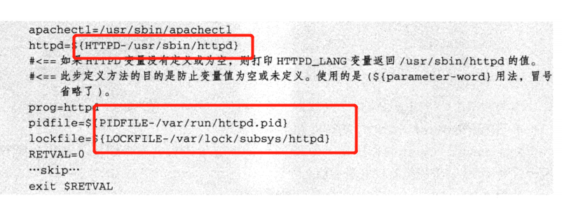

# 4.4 shell 特殊扩展变量的知识实践

 

## 4.4.1 shell特殊扩展变量介绍


| **表达式**             | 记忆方法                              | **说明**                                                     |
| ---------------------- | ------------------------------------- | ------------------------------------------------------------ |
| **${parameter:-word}** | - 没有则使用（**使用**）              | 如果parameter的变量值为空或者未赋值，则会返回word字符串并替代变量的值，<br/>用途：如果变量未定义，则返回备用变量值，防止变量为空或因未定义而导致异常。 |
| **${parameter:=word}** | =没有则使用并**替换**                 | 如果parameter的变量值为空或者未赋值，则会设置这个变量值为word，并返回其值，<br/>用途：比上面一个 多一步赋值操作。 |
| **${parameter:?word}** | ？没有则给出解答（**标准错误**）      | 如果parameter的变量值为空或者未赋值，则word字符串当做标准错误输出，否则输出变量的值，<br/>用途：用于捕捉由于变量未定义二导致的错误，并退出程序。 |
| **${parameter:+word}** | +有则替换，没有不处理（**有则替换**） | 如果parameter的变量值为空或者未赋值，则什么都不做，否则word字符串替代变量的值 |


## 4.4.2 shell 特殊扩展变量实践

### （1）${parameter:-word}

>未赋值或为空，则返回word字符串替代变量都值。

#### 4-35 

```shell
[root@cdyf138 4]# echo $test

[root@cdyf138 4]# result=${test:-UNSET}
[root@cdyf138 4]# echo $result
UNSET
[root@cdyf138 4]# test=oldboy
[root@cdyf138 4]# result=${test:-UNSET}
[root@cdyf138 4]# echo $result
oldboy
```


### (2)  ${parameter:=word}

> 未赋值或为空，则返回word字符串替代变量都值。

#### 4-37

```shell
[root@cdyf138 opt]# result=${test:=UNSET}
[root@cdyf138 opt]# echo $result 
UNSET
[root@cdyf138 opt]# echo $test
UNSET
```

### (3)  ${parameter:?word}

#### 4-38

```shell
[root@cdyf138 opt]# echo ${key:?not defind}
-bash: key: not defind
[root@cdyf138 opt]# key=1
[root@cdyf138 opt]# echo ${key:?not defind}
1
[root@cdyf138 opt]# echo ${key?not defind}
1
[root@cdyf138 opt]# unset key
[root@cdyf138 opt]# echo ${key:?not defind}
-bash: key: not defind
```

#### (4)  ${parameter:+word}

4-39

```shell
[root@cdyf138 opt]# oldboy=${oldgirl:+word}
[root@cdyf138 opt]# echo $oldboy

[root@cdyf138 opt]# oldgirl=19
[root@cdyf138 opt]# oldboy=${oldgirl:+word}
[root@cdyf138 opt]# echo $oldboy
word
```


## 4.4.3 shell特殊变量的生产常见应用案例

#### 4-40：实现apache服务启动脚本/etc/init.d/httpd



#### 4-41: 删除7天钱的过期数据备份

```shell
#!/bin/bash
find ${path-/tmp} -name "*.tar.gz" -type f -mtime +7|xargs rm -f

```

