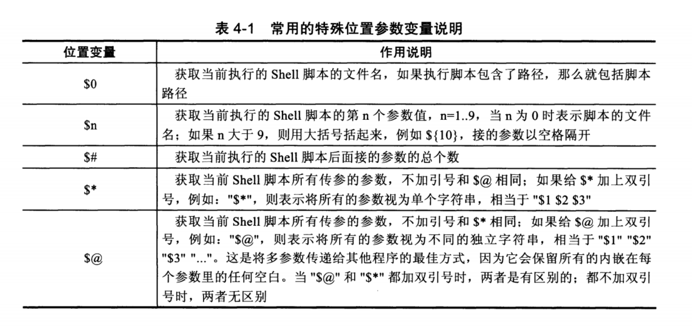
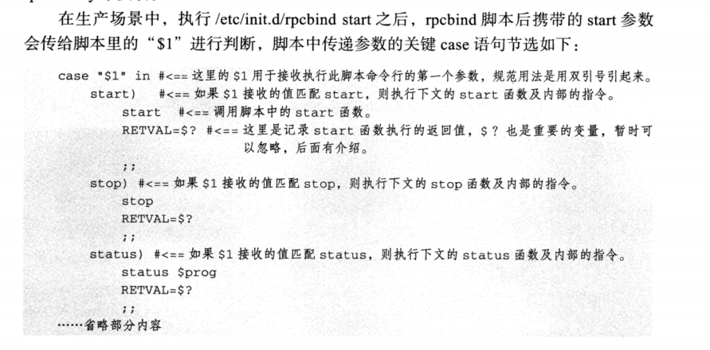
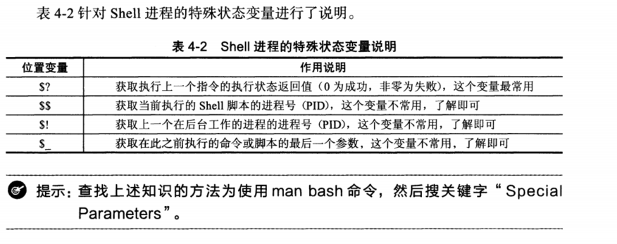

# 4.1 shell中特殊且重要的变量


## 4.1.1  shell中特殊位置参数变量



### (1) $1 $2 $3...$9, ${10}${11}

#### 范例  4-1 多个参数传递

```shell
[root@cdyf138 test]# sh n.sh 1 2 4
n.sh
1 2 4
[root@cdyf138 test]# sh /root/test/n.sh 1 3 4
/root/test/n.sh
1 3 4
[root@cdyf138 test]# sh /root/test/n.sh "test 13141"
/root/test/n.sh
test 13141
[root@cdyf138 test]# sh /root/test/n.sh test boy
/root/test/n.sh
test boy

```

> 双引号中的 参数当成一个


#### 范例  4-2

```shell
[root@cdyf138 test]# cat p.sh 
#!/bin/bash
echo $1 $2
[root@cdyf138 test]# sh p.sh  logger bingbing
logger bingbing
[root@cdyf138 test]# sh p.sh "logger bingbing"
logger bingbing
[root@cdyf138 test]# sh p.sh "logger bingbing" oldgirl
logger bingbing oldgirl
```


#### 范例 4-3

```shell
[root@cdyf138 test]# cat n.sh 
$1 $2 $3 $4 $5 $6 $7 $8 $9 $10 $11 $12 $13 $14 $15
[root@cdyf138 test]# cat n.sh 
$1 $2 $3 $4 $5 $6 $7 $8 $9 $10 $11 $12 $13 $14 $15
[root@cdyf138 test]# vim n.sh 
[root@cdyf138 test]# cat n.sh 
echo $1 $2 $3 $4 $5 $6 $7 $8 $9 $10 $11 $12 $13 $14 $15
[root@cdyf138 test]# echo {a..z}
a b c d e f g h i j k l m n o p q r s t u v w x y z
[root@cdyf138 test]# sh n.sh {a..z}
a b c d e f g h i a0 a1 a2 a3 a4 a5

```

>位置大于9 用大括号括起来参数





### (2) $0  特殊变量的作用及变量实践

> 取出执行脚本的名称（包含路径）


#### 范例 4-4  获取脚本名称及路径

```shell
[root@cdyf138 test]# cat n.sh 
echo $0
[root@cdyf138 test]# sh n.sh 
n.sh
[root@cdyf138 test]# sh /root/test/n.sh 
/root/test/n.sh
```


#### 范例 4-5 单独获取命令自身功能用法dirname和basename

```shell
[root@cdyf138 test]# dirname /root/test/n.sh 
/root/test
[root@cdyf138 test]# basename /root/test/n.sh 
n.sh
```

#### 范例 4-6 利用$0和上述命分别取出脚本名和路径

```shell
[root@cdyf138 test]# cat n.sh 
dirname $0
basename $0
[root@cdyf138 test]# sh /root/test/n.sh 
/root/test
n.sh
```


### (3) $# 特殊变量获取脚本传参个数实践

#### 范例 4-7  $#获取脚本传参个数

```shell
[root@cdyf138 test]# cat q.sh 
echo $1 $2 $3 $4 $5 $6 $7 $8 $9
echo $#
[root@cdyf138 test]# sh q.sh {a..z}
a b c d e f g h i
26
```


#### 范例 4-8  判断参数是否满足要求

```shell
if [ $# -ne 2 ] # 判断参数是否等于2
    then
        echo "USAGE:/bin/sh $) arg1 arg2"
        exit 1
fi
```


### (4) $* 和$@ 特殊变量功能及区别说明

#### 范例 4-9  利用set设置位置参数

```shell
[root@cdyf138 4]# set -- "I am" handsome oldboy.
[root@cdyf138 4]# echo $#
3
[root@cdyf138 4]# echo $1
I am
[root@cdyf138 4]# echo $2
handsome
[root@cdyf138 4]# echo $4

[root@cdyf138 4]# echo $4

[root@cdyf138 4]# echo $3
oldboy.
[root@cdyf138 4]# echo $*
I am handsome oldboy.
[root@cdyf138 4]# echo $#
3
[root@cdyf138 4]# echo $@
I am handsome oldboy.
[root@cdyf138 4]# for i in $*;do echo $i;done
I
am
handsome
oldboy.
[root@cdyf138 4]# for i in $@;do echo $i;done
I
am
handsome
oldboy.
[root@cdyf138 4]# echo "$*"
I am handsome oldboy.
[root@cdyf138 4]# echo "$@"
I am handsome oldboy.
[root@cdyf138 4]# for i in "$@";do echo $i;done
I am
handsome
oldboy.
[root@cdyf138 4]# for i in "$*";do echo $i;done
I am handsome oldboy.
[root@cdyf138 4]# for i;do echo $i;done
I am
handsome
oldboy.
[root@cdyf138 4]# shift
[root@cdyf138 4]# echo $#
2
[root@cdyf138 4]# echo $1
handsome
[root@cdyf138 4]# echo $2
oldboy.
```


## 4.1.2 shell 进程中的特殊状态变量




### (1) $?特殊变量功能实践

#### 4-10 执行命令返回值

```shell
[cdyf@cdyf138 4]$ reeg
bash: reeg: command not found
[cdyf@cdyf138 4]$ echo $?
127
[cdyf@cdyf138 4]$ pwd
/oldboy/4
[cdyf@cdyf138 4]$ echo $?
0
```

> 0 表示成功，非零便是失败


#### 4-11 根据返回值来判断软件是否安装成功

```shell
[cdyf@cdyf138 4]$ yum install test
Loaded plugins: fastestmirror, priorities
You need to be root to perform this command.
[cdyf@cdyf138 4]$ echo $?
1
```


#### 4-13 通过脚本控制命令及脚本执行后的返回值。

```shell
[root@cdyf138 4]# sh test4.sh 
must be two arges.
[root@cdyf138 4]# echo $?
119
[root@cdyf138 4]# cat test4.sh 
[ $# -ne 2 ] && {
echo "must be two arges."
exit 119
}

```


### （2） $$ 特殊变量功能及实践

#### 4-15 获取脚本的PID

```shell
[root@cdyf138 4]# cat test_pid.sh 
echo $$ >/tmp/a.pid
sleep 200
[root@cdyf138 4]# ps -ef | grep test_pid | grep -v grep
[root@cdyf138 4]# sh test_pid.sh 
^C
[root@cdyf138 4]# ps -ef | grep test_pid | grep -v grep
[root@cdyf138 4]# sh test_pid.sh 
^C
[root@cdyf138 4]# cat /tmp/a.pid 
22493

```

#### 4-16 多次执行脚本，进程只有一个，必须杀掉

```shell
[root@cdyf138 4]# cat pid.sh 
#!/bin/bash
pidpath=/tmp/a.pid
if [ -f "$pidpath"  ]
  then
    kill `cat $pidpath`>/dev/null 2>&1
    rm -f $pidpath
fi
echo $$ >$pidpath
sleep 300
[root@cdyf138 4]# ls
func.sh  n.sh  pid.sh  p.sh  q.sh  t2.sh  test4.sh  test_pid.sh  test.sh
[root@cdyf138 4]# ps -ef | grep pid.sh| grep -v grep
[root@cdyf138 4]# sh pid.sh &
[1] 22787
[root@cdyf138 4]# ps -ef | grep pid.sh| grep -v grep
root     22787 30807  0 19:09 pts/0    00:00:00 sh pid.sh
[root@cdyf138 4]# ps -ef | grep pid.sh| grep -v grep
root     22787 30807  0 19:09 pts/0    00:00:00 sh pid.sh
[root@cdyf138 4]# ps -ef | grep pid.sh| grep -v grep
root     22787 30807  0 19:09 pts/0    00:00:00 sh pid.sh
[root@cdyf138 4]# ps -ef | grep pid.sh| grep -v grep
root     22787 30807  0 19:09 pts/0    00:00:00 sh pid.sh

```


### （3）$_ 特殊变量功能及实践

> $_作用是获得上一条命令的**最后一个参数值**。

```shell
[root@cdyf138 4]# cat p.sh 
#!/bin/bash
echo $1 $2
[root@cdyf138 4]# sh p.sh 1 2
1 2
[root@cdyf138 4]# echo $_
2
```


### （4）$! 特殊变量功能及实践

> $! 获取**上一个脚本执行**的pid


