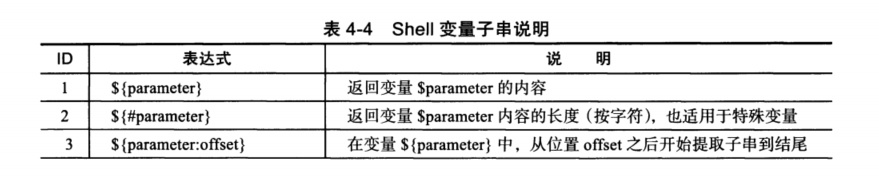
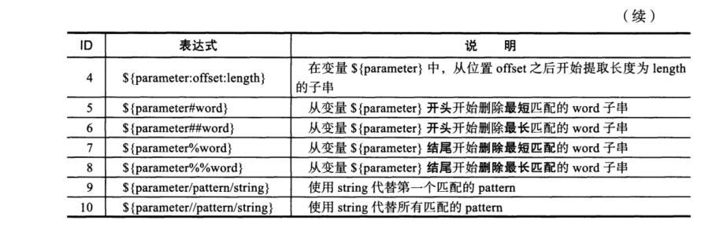

# 4.3 shell变量子串知识及实践


## 4.3.1 shell变量子串介绍







## 4.3.2 shell 变量子串的实践


**准备：定义OLDBOY**

```shell
[root@cdyf138 4]# OLDBOY="I am oldboy"
[root@cdyf138 4]# echo ${OLDBOY}
I am oldboy
[root@cdyf138 4]# echo $OLDBOY
I am oldboy
```


#### 范例 4-24  返回变量值长度

```shell
[root@cdyf138 4]# echo ${#OLDBOY}
11
[root@cdyf138 4]# expr length "$OLDBOY"
11
[root@cdyf138 4]# echo "$OLDBOY"|wc -L
11
```


> 计算变量长度的方法中，变量的字符串方式是最快都，即${#OLDBOY}


```shell
[root@cdyf138 4]# OLDBOY="I am oldboy"     
[root@cdyf138 4]# echo ${OLDBOY}
I am oldboy
# 从第二个字符之后开始截取
[root@cdyf138 4]# echo ${OLDBOY:2}
am oldboy
# 从第二个字符开始截取，截取两个字符
[root@cdyf138 4]# echo ${OLDBOY:2:2}
am
[root@cdyf138 4]# echo ${OLDBOY}|cut -c 3-4
am
[root@cdyf138 4]# OLDBOY=abcABC123ABCabc
[root@cdyf138 4]# echo $OLDBOY
abcABC123ABCabc
# 从开头匹配最短字符
[root@cdyf138 4]# echo ${OLDBOY#a*C}
123ABCabc
#从匹配最短字符
[root@cdyf138 4]# echo ${OLDBOY#a*c}
ABC123ABCabc
[root@cdyf138 4]# echo ${OLDBOY}
abcABC123ABCabc
# 从开头开始删除最长匹配
[root@cdyf138 4]# echo ${OLDBOY##a*C}
abc
[root@cdyf138 4]# echo ${OLDBOY##a*c}
# 从结尾开始产出最长匹配
[root@cdyf138 4]# echo ${OLDBOY%%a*C}
abcABC123ABCabc
[root@cdyf138 4]# echo ${OLDBOY%%a*c}

```

>
>
>**有关删除匹配小结**
>
>- `#`表示从开头删除最短。
>- `##` 表示从开头删除匹配最长
>- % 表示从结尾删除匹配最短
>- %% 表示从结尾删除匹配最长
>- a*c便是匹配的字符串，*表示匹配所有，a*c匹配以a开头中间任意多个字符串。
>- a*C 同上


#### 4-33 使用oldgirl字符串代替变量$OLDBOY匹配的oldboy字符串

```shell
[root@cdyf138 4]# OLDBOY="I am oldboy ,yes,oldboy"
[root@cdyf138 4]# echo $OLDBOY
I am oldboy ,yes,oldboy
[root@cdyf138 4]# echo ${OLDBOY/oldboy/oldgirl}
I am oldgirl ,yes,oldboy
[root@cdyf138 4]# echo ${OLDBOY//oldboy/oldgirl}
I am oldgirl ,yes,oldgirl

```

>一个/ 表示替换匹配的第一个字符串。
>
>两个// 标志替换匹配的所有字符串。


4-34 去掉所有文件名的_finished字符串

```shell
for f in `ls *fn*.jpg`;
	do 
		mv $f `echo ${f//_finished/}`;
done
```

