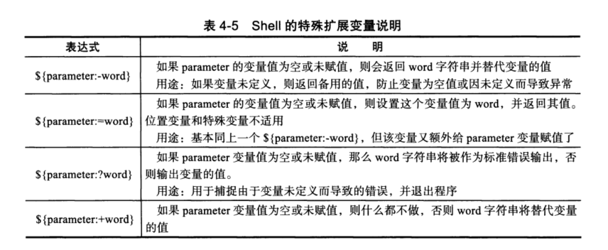

# 4.4 shell 特殊扩展变量的知识实践

 

## 4.4.1 shell特殊扩展变量介绍



## 4.4.2 shell 特殊扩展变量实践

### （1）${parameter:-word}

>未赋值或为空，则返回word字符串替代变量都值。

#### 4-35 

```shell
[root@cdyf138 4]# echo $test

[root@cdyf138 4]# result=${test:-UNSET}
[root@cdyf138 4]# echo $result
UNSET
[root@cdyf138 4]# test=oldboy
[root@cdyf138 4]# result=${test:-UNSET}
[root@cdyf138 4]# echo $result
oldboy
```


#### (2){parameter:=word}

> 未赋值或为空，则返回word字符串替代变量都值。