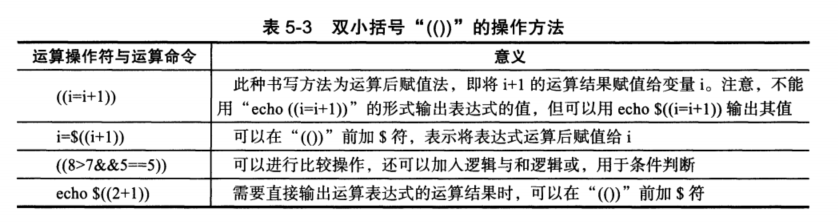

# 5.2 双小括号“(())”运算符


## 5.2.1 基本语法



## 5.2.2  数值运算实战


#### 5-1  数值计算

```bash
[root@cdyf138 4]# echo $((1+1))
2
[root@cdyf138 4]# echo $((6-3))
3
[root@cdyf138 4]# ((i=5))
[root@cdyf138 4]# ((i=i*2))
[root@cdyf138 4]# echo $i
10
```

#### 5.2  综合算术计算

```bash
[root@cdyf138 4]# ((a=1+2**3-4%3))
[root@cdyf138 4]# echo $a
8
[root@cdyf138 4]# b=$((a=1+2**3-4%3))
[root@cdyf138 4]# echo $b
8
[root@cdyf138 4]# a=$((100*(100+1)/2))
[root@cdyf138 4]# echo $a
5050
[root@cdyf138 4]# echo $((100*(100+1)/2))
5050

```

> 变量放在里面，也可以放在外面。


#### 5.3 特殊运算符小例

```bash
[root@cdyf138 4]# a=8
[root@cdyf138 4]# echo $((a=a+1))
9
[root@cdyf138 4]# echo $((a+=1))
10
[root@cdyf138 4]# echo $((a**2))
100
```


#### 5.4 比较及判断（bool值判断）

```bash
[root@cdyf138 4]# echo $((3<8))
1
[root@cdyf138 4]# echo $((8<3))
0
[root@cdyf138 4]# echo $((8==8))
1
[root@cdyf138 4]# echo $((8>7&&5==5))
1
```

> bool值判断，0或者1


#### 5.5 --和++ 

```bash
[root@cdyf138 4]# a=10
[root@cdyf138 4]# echo $((a++))
10
[root@cdyf138 4]# echo $a
11
[root@cdyf138 4]# a=11
[root@cdyf138 4]# echo $((a--))
11
[root@cdyf138 4]# echo $a
10
[root@cdyf138 4]# a=10
[root@cdyf138 4]# echo $a
10
[root@cdyf138 4]# echo $((--a))
9
[root@cdyf138 4]# echo $a
9
[root@cdyf138 4]# echo $((++a))
10
[root@cdyf138 4]# echo $a
10
```

> 注意++，--：变量在前，先输出变量再自增自减；变量在后，先运算输出变量的值
>


#### 5.6  赋值变量

```bash
[root@cdyf138 4]# myvar=99
[root@cdyf138 4]# echo $((myvar+1))
100
[root@cdyf138 4]# myvar=$((myvar + 1))
[root@cdyf138 4]# echo $myvar
100
```


#### 5.7 运算命令执行示例

```bash
[root@cdyf138 4]# echo $((6+2))
8
[root@cdyf138 4]# echo $((6-2))
4
[root@cdyf138 4]# echo $((6*2))
12
[root@cdyf138 4]# echo $((6/2))
3
[root@cdyf138 4]# echo $((6%2))
0
[root@cdyf138 4]# echo $((6**2))
36
```


#### 5.8 运算shell脚本示例

- 命令行传参的方式

```bash
[root@cdyf138 5]# cat test.sh 
#!/bin/bash
a=$1
b=$2
echo "a-b=$(($a-$b))"
echo "a+b=$(($a+$b))"
echo "a*b=$(($a*$b))"
echo "a/b=$(($a/$b))"
echo "a**b=$(($a**$b))"
echo "a%b=$(($a%$b))"
[root@cdyf138 5]# sh test.sh 6 2
a-b=4
a+b=8
a*b=12
a/b=3
a**b=36
a%b=0

```

- 传参方式

```bash
echo $(($1$2$3))
```


#### 5.10 实现输入 两个数进行加，减乘除计算器

```bash
#!/bin/bash
# Author: wuzb

read -t 15 -p "Plase input two number:" a b
[ ${#a} -le 0 ] && {
  echo "the first num is null"
  exit 1
}
[ ${#b} -le 0 ] && {
  echo "the second num is null"
  exit 1
}
expr $a + 1 &>/dev/null
RETVAL_A=$?
expr $b + 1 &>/dev/null
RETVAL_B=$?

if [ $RETVAL_A -ne 0 -o  $RETVAL_B -ne 0 ];then
  echo " one of the num is not num ,pls input again."
  exit 1
fi

echo "a-b=$(($a-$b))"
echo "a+b=$(($a+$b))"
echo "a*b=$(($a*$b))"
echo "a/b=$(($a/$b))"
echo "a**b=$(($a**$b))"
echo "a%b=$(($a%$b))"
```

