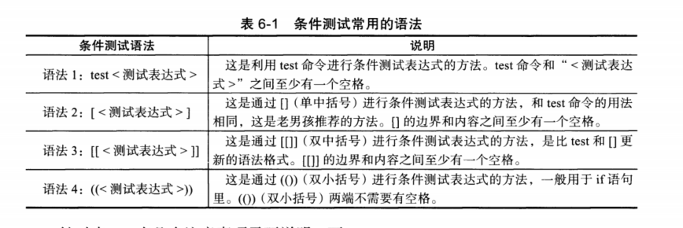
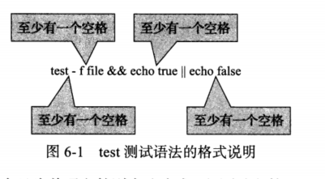
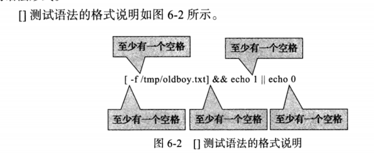
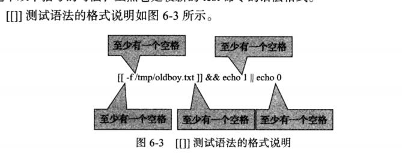

# 6.1 Shell 脚本的条件测试


## 6.1.1 条件测试的方法

​     通常，在bash中，各种条件和流程控制结构中，都要进行条件测试，根据条件测试执行不同操作。

执行条件测试返回  真假 ，**命令返回0表示正，非零表示假。**





>1. 语法1，中test语法和2中的[]是等价的。语法三种的[[]]为扩展test命令，语法4中的(())常用语**计算**，**建议语法 []**
>2. [[]] 中可以使用通配符等进行模式匹配，其他语法不行。
>3. && ||  > < 等操作可以用在[[]]中，但是不能用于[]中， 在[]中一般用 -a -o -gt -lt等
>4. 对于整数的关系运算，可以使用shell算术运算符(())


## 6.1.2  test条件测试示例

> 语法为： test <测试表达式>

test -f file && echo true || echo false   如果文件存在，则 true。





#### 6-1 ，测试文件

```shell
[root@cdyf138 5]# test -f file && echo true || echo false 
false
[root@cdyf138 5]# touch file
[root@cdyf138 5]# test -f file && echo true || echo false 
true
```

#### 6-2 测试文件时候使用 -z (字符串长度为0 表达式成立)

```shell
[root@cdyf138 5]# test -f file && echo true || echo false 
false
[root@cdyf138 5]# touch file
[root@cdyf138 5]# test -f file && echo true || echo false 
true
[root@cdyf138 5]# test -z “oldboy”&&echo 1|| echo 0
0
[root@cdyf138 5]# 
[root@cdyf138 5]# char="oldboy"
[root@cdyf138 5]# test -z "$char"&&echo 1||echo 0
0
[root@cdyf138 5]# char=""
[root@cdyf138 5]# test -z "$char"&&echo 1||echo 0
1
```

> test语法大部分可以被[]  [[]]代替，一般不选择。


## 6.1.3 []使用示例


>[]  条件测试的语法格式： [ <条件表达式> ]
>
>[]  和test等价，**中括号内部两端都要有空格**


```shell
[ -f /tmp/oldboy.txt ] && echo 1 || echo 0 
```



#### 6-3 测试文件

```shell
[root@cdyf138 5]# [ -f /tmp/oldboy.txt ] && echo 1 || echo 0 
0
[root@cdyf138 5]# touch /tmp/oldboy.txt
[root@cdyf138 5]# [ -f /tmp/oldboy.txt ] && echo 1 || echo 0 
1
[root@cdyf138 5]# [ -f /tmp/oldboy.txt ] && echo 1
1
[root@cdyf138 5]# [ -f /tmp/oldboy.txt ]  || echo 0 
[root@cdyf138 5]# [ -f /tmp/oldgirl.txt ]  || echo 0 
0
```


## 6.1.4 [[]] 使用示例

>语法：[[ <测试表达式> ]]
>
>**双括号两端也要有空格**
>
>与 []  test 区别： 内部可以使用通配符等就行模式匹配，&& || ><都可以用。



#### 6.4 使用示例

```shell
[root@cdyf138 5]# [[ -f /tmp/oldboy.txt ]] || echo 0
[root@cdyf138 5]# [[ -f /tmp/oldboy.txt ]] && echo 1
1
[root@cdyf138 5]# rm -rf /tmp/oldboy.txt 
[root@cdyf138 5]# [[ -f /tmp/oldboy.txt ]] || echo 0
0
```