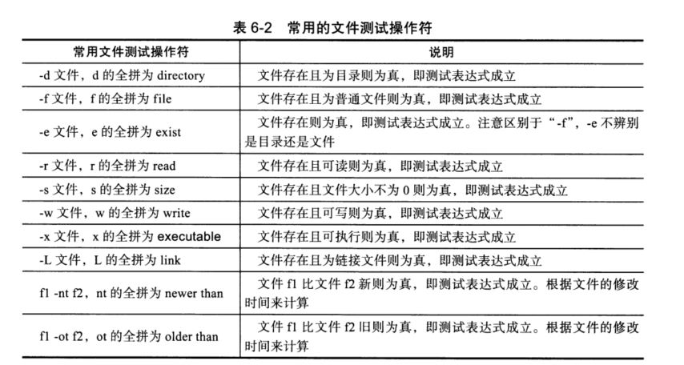

# 6.2 文件测试表达式


## 6.2.1 文件测试表达式用法




## 6.2.2 文件测试表达式举例

### (1）普通文件测试表达式


#### 6.5 普通文件条件表达式

```shell
[root@cdyf138 6]# [ -f /tmp/oldboy.txt ] && echo 1 || echo 0
1
```

#### 6.6 目录测试

```shell
[root@cdyf138 6]# mkdir oldgirl
[root@cdyf138 6]# ls
oldgirl
[root@cdyf138 6]# [ -f oldgirl  ] && echo 1 || echo 0
0
[root@cdyf138 6]# [ -e oldgirl  ] && echo 1 || echo 0
1
[root@cdyf138 6]# [ -d oldgirl  ] && echo 1 || echo 0
1
[root@cdyf138 6]# [ -d oldboy  ] && echo 1 || echo 0
0
```


### (2) 测试文件属性


#### 6.7  属性测试

```shell
[root@cdyf138 6]# ls -al
total 0
drwxr-xr-x 3 root root 35 Jan 23 14:25 .
drwxr-xr-x 5 root root 33 Jan 23 11:34 ..
-rw-r--r-- 1 root root  0 Jan 23 14:25 oldboy
drwxr-xr-x 2 root root  6 Jan 23 14:23 oldgirl
[root@cdyf138 6]# [ -r oldboy ] && echo 1 || echo 0
1
[root@cdyf138 6]# [ -w oldboy ] && echo 1 || echo 0
1
[root@cdyf138 6]# [ -x oldboy ] && echo 1 || echo 0
0
[root@cdyf138 6]# chmod 001 oldboy
[root@cdyf138 6]# ls -al
total 0
drwxr-xr-x 3 root root 35 Jan 23 14:25 .
drwxr-xr-x 5 root root 33 Jan 23 11:34 ..
---------x 1 root root  0 Jan 23 14:25 oldboy
drwxr-xr-x 2 root root  6 Jan 23 14:23 oldgirl
[root@cdyf138 6]# [ -x oldboy ] && echo 1 || echo 0
1
[root@cdyf138 6]# echo 'echo test' >oldboy
[root@cdyf138 6]# [ -r oldboy ] && echo 1 || echo 0
1
[root@cdyf138 6]# cat oldboy 
echo test
[root@cdyf138 6]# [ -x oldboy ] && echo 1 || echo 0
1
[root@cdyf138 6]# ./oldboy
test
```


### (3)测试shell变量示例

#### 6.8 单个文件

```shell
[root@cdyf138 6]# file1=/etc/services;file2=/etc/rc.local
[root@cdyf138 6]# echo $file1 $file2
/etc/services /etc/rc.local
[root@cdyf138 6]# [ -f "$file1" ] && echo 1 || echo 0
1
[root@cdyf138 6]# [ -d "$file1" ] && echo 1 || echo 0
0
[root@cdyf138 6]# [ -s "$file1" ] && echo 1 || echo 0
1
[root@cdyf138 6]# [ -e "$file1" ] && echo 1 || echo 0
1
```

#### 6.9 目录测试

```shell
[root@cdyf138 6]# [ -e /etc ] && echo 1 || echo 0
1
[root@cdyf138 6]# [ -w /etc ] && echo 1 || echo 0
1
[root@cdyf138 6]# su cdyf
welcome to cdyf centos.
[cdyf@cdyf138 6]$ [ -w /etc ] && echo 1 || echo 0
0
```


#### 6.10 测试变量特殊写法

```shell
[root@cdyf138 ~]# [ -f $oldgirl ] && echo  1|^Cecho 0
[root@cdyf138 ~]# echo $oldgirl

[root@cdyf138 ~]# [ -f $oldgirl ] && echo  1|| echo 0
1
[root@cdyf138 ~]# [ -f "$oldgirl" ] && echo  1|| echo 0
0
[root@cdyf138 ~]# [ -f "/etc/services" ] && echo  1|| echo 0
1
[root@cdyf138 ~]# [ -f /etc/services ] && echo  1|| echo 0
1
```

> 实体 文件，加不加双引号结果一样
>
> **如果是变量 ，加了双引号和不加结果不一样。**

#### 6.13 写出简单高效的测试文件

```shell
[root@cdyf138 6]# ls
oldboy  oldgirl
[root@cdyf138 6]# [ -x oldboy ] && echo 1
1
[root@cdyf138 6]# [ -f /etc ] || echo 0
0
```

> **没必要写全条件**


## 6.2.3 特殊条件表达式案例


上面判断相当于

```shell
if [ 条件 ] 
  then 
    命令1
    命令2 
    命令3
fi
```


#### 6.15 若果条件不成立，执行大括号内容

```shell
[root@cdyf138 6]# cat 6_15.sh 
#!/bin/bash
[ -f /etc ] || {
  echo 1
  echo 2
  echo 3
}
[root@cdyf138 6]# sh 6_15.sh 
1
2
3
[root@cdyf138 6]# [ -f /etc ] || { echo "I am oldboy";echo "I am linuxer";}
I am oldboy
I am linuxer
```

