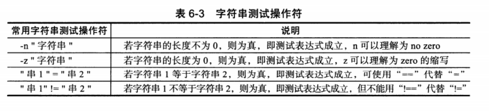

# 6.3 字符串测试表达式


## 6.3.1 字符串测试操作符

> 字符串测试操作符：**比较是否相同，测试字符串长度是否为零，字符串是否为null等**



- 字符串测试，一定要加双引号比较。
- 比较符号 =   != 两端一定要有空格。
- != 和等于，可以用于比较两个字符串是否相同。


#### 6.16 字符串表达式测试

```shell
[root@cdyf138 6]# 
[root@cdyf138 6]# [ -n "abc" ] && echo 1 || echo 0
1
[root@cdyf138 6]# test -n "abc" && echo 1 || echo 0
1
[root@cdyf138 6]# var="oldboy"
[root@cdyf138 6]# [ -n "$var" ] && echo 1 || echo 0
1
[root@cdyf138 6]# [ -z "$var" ] && echo 1 || echo 0
0
[root@cdyf138 6]# [ "abc" = "abc" ] && echo 1 || echo 0
1
[root@cdyf138 6]# [ "abc" = "adc" ] && echo 1 || echo 0
0
[root@cdyf138 6]# [ "$var" = "oldboy" ] && echo 1 || echo 0
1
[root@cdyf138 6]# [ "$var" == "oldboy" ] && echo 1 || echo 0
1
[root@cdyf138 6]# [ "$var" != "oldboy" ] && echo 1 || echo 0
0
```

#### 6.17 等号两边没有空格带来的问题

```shell
[root@cdyf138 6]# [ "abc"="1" ] && echo 1 || echo 0
1
[root@cdyf138 6]# [ "abc" = "1" ] && echo 1 || echo 0
0
```

> **没有空格会出现逻辑错误**

#### 6.18 不加引号带来的问题

```shell
[root@cdyf138 6]# var=""
[root@cdyf138 6]# [ -n "$var" ] && echo 1 || echo 0
0
[root@cdyf138 6]# [ -n $var ] && echo 1 || echo 0
1
[root@cdyf138 6]# [ -z "$var" ] && echo 1 || echo 0
1
```

> 特别注意：字符串比较不加引号，带来逻辑错误


## 6.3.2 生产案例


#### 6.19网卡启动脚本

```shell
[root@cdyf138 6]# sed -n '30,31p' /etc/init.d/network
# Check that networking is up.
[ "${NETWORKING}" = "no" ] && exit 6

```

