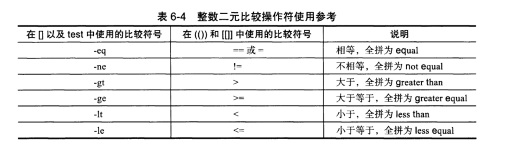

# 6.4 整数二元比较操作符


## 6.4.1 整数二元比较操作符



-  `= `和`!=` 也可以在`[]`中比较使用。
- 也可以在`[[]]`中实用包含 `-gt`  `lt` 单不建议这么用
- **比较符号两端也要有空格**

#### 6.21 二元数字

```shell
[root@cdyf138 6]# [ 2 > 1 ] && echo 1 || echo 0
1
[root@cdyf138 6]# [ 2 < 1 ] && echo 1 || echo 0
1
[root@cdyf138 6]# [ 2 \< 1 ] && echo 1 || echo 0
0

```

> 尽量按照表格的要求使用，容易出错


#### 6.22 [] 使用-gt, -le等

```shell
[root@cdyf138 6]# [ 2 -gt 1 ] && echo 1 || echo 0
1
[root@cdyf138 6]# [ 2 -ge 1 ] && echo 1 || echo 0
1
[root@cdyf138 6]# [ 2 -le 1 ] && echo 1 || echo 0
0
[root@cdyf138 6]# [ 2 -lt 1 ] && echo 1 || echo 0
0
```

#### 6.23 [[]]中使用

```shell
[root@cdyf138 6]# [[ 5 > 6 ]] && echo 1 || echo 0
0
[root@cdyf138 6]# [[ 5 < 6 ]] && echo 1 || echo 0
1
[root@cdyf138 6]# [[ 5 != 6 ]] && echo 1 || echo 0
1
[root@cdyf138 6]# [[ 5 = 6 ]] && echo 1 || echo 0
0
[root@cdyf138 6]# [[ 5 -gt 6 ]] && echo 1 || echo 0
0
[root@cdyf138 6]# [[ 5 -ge 6 ]] && echo 1 || echo 0
0
[root@cdyf138 6]# [[ 5 -lt 6 ]] && echo 1 || echo 0
1
[root@cdyf138 6]# [[ 5 -le 6 ]] && echo 1 || echo 0
1
```

> 常规化比较不建议用 [[]]，除非带有正则的匹配

#### 6.24 (())中使用

```shell
[root@cdyf138 6]# ((3>2)) && echo 1 || echo 0
1
[root@cdyf138 6]# ((3<2)) && echo 1 || echo 0
0
[root@cdyf138 6]# ((3==2)) && echo 1 || echo 0
0
[root@cdyf138 6]# ((3!=2)) && echo 1 || echo 0
1
```


> **总结：**
>
> 整数加双引号的比较是对的。
>
> [[]]类似 -eq的写法是对的。
>
> []中可以使用= !=
>
> (())不能使用-eq等的写法，可以使用类似> < 的写法。
>
> **特别说明**：工作场景中整数比较，推荐使用  [] (类似eq的写法)


## 6.4.2 整数变量测试实战示例


#### 6-25 通过[]实现整数条件测试

```shell
[root@cdyf138 6]# a1=98;a2=99
[root@cdyf138 6]# [ $a1 -eq $a2 ] && echo 1 || echo 0
0
[root@cdyf138 6]# [ $a1 -gt $a2 ] && echo 1 || echo 0
0
[root@cdyf138 6]# [ $a1 -lt $a2 ] && echo 1 || echo 0
1
```

#### 6-26 [[]] 和(())

```
[root@cdyf138 6]# [[ $a1 > $a2 ]] && echo 1 || echo 0
0
[root@cdyf138 6]# [[ $a1 < $a2 ]] && echo 1 || echo 0
1
[root@cdyf138 6]# (($a1<=$a2)) && echo 1 || echo 0
1
```

> 推荐优先级： []  > (()) > [[]]