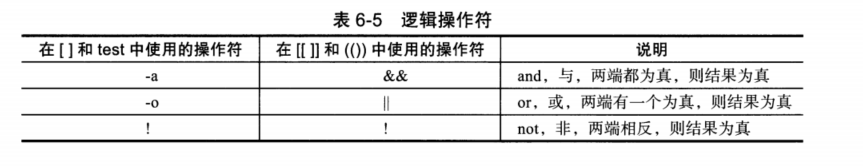

# 6.5 逻辑运算符


## 6.5.1  逻辑运算符介绍



> **与或者非**
>
> **与：and &&  -a**
>
> **或者： or  ||  -o**
>
> **非 ：** ！


## 6.5.2 逻辑操作符实践


#### 6-28 []中文件测试表达式

```shell
[root@cdyf138 6]# f1=/etc/rc.local;f2=/etc/services
[root@cdyf138 6]# echo -ne "$f1 $f2\n"
/etc/rc.local /etc/services
[root@cdyf138 6]# [ -f "$f1" -a  -f "$f2" ] && echo 1 || echo 0
1
[root@cdyf138 6]# [ -f "$f1" -o  -f "$f2" ] && echo 1 || echo 0
1
[root@cdyf138 6]# [ -f "$f111" -o  -f "$f222" ] && echo 1 || echo 0
0
[root@cdyf138 6]# [ -f "$f1" &&  -f "$f2" ] && echo 1 || echo 0
-bash: [: missing `]'
0
[root@cdyf138 6]# [ -f "$f1" ] && [ -f "$f2" ] && echo 1 || echo 0
1
```

#### 6-29  配合字符串

```shell
[root@cdyf138 6]# a="oldboy";b="oldgirl"
[root@cdyf138 6]# echo -ne "$a $b\n"
oldboy oldgirl
[root@cdyf138 6]# [[ ! -n "$a" && "$b" = "$b"  ]] && echo 1 || echo 0
0
[root@cdyf138 6]# [[ ! -n "$a" && "$a" = "$b"  ]] && echo 1 || echo 0
0
[root@cdyf138 6]# [[ ! -n "$a" && "$a" = "$b"  ]] && echo 1 || echo 0
0
[root@cdyf138 6]# [[ -z "$a" && "$a" != "$b"  ]] && echo 1 || echo 0
0
[root@cdyf138 6]# [[ -z "$a" || "$a" != "$b"  ]] && echo 1 || echo 0
1
[root@cdyf138 6]# [[ -z "$a" -o "$a" != "$b"  ]] && echo 1 || echo 0
-bash: syntax error in conditional expression
-bash: syntax error near `-o'
```

#### 6-30 （()）操作符配合整数测试

```shell
[root@cdyf138 6]# m=21;n=38
[root@cdyf138 6]# ((m>20&&n>30)) && echo 1 || echo 0
1
[root@cdyf138 6]# ((m<20||n>30)) && echo 1 || echo 0
1
[root@cdyf138 6]# ((m<20||n<30)) && echo 1 || echo 0
0
[root@cdyf138 6]# ((m<20 -a n<30)) && echo 1 || echo 0
-bash: ((: m<20 -a n<30: syntax error in expression (error token is "n<30")
0
```

#### 6-31 多个[],通过与或非混合测试

```shell
[root@cdyf138 6]# m=21;n=38
[root@cdyf138 6]# [ $m -ge 20 -a $n -lt 30 ] && echo 1 || echo 0
0
[root@cdyf138 6]# [ $m -ge 20 ] || [ $n -lt 30 ] && echo 1 || echo 0
1
```

> **-a  -o 需要用在[]**
>
> **&& || 可以用在[[]] (()) 内  []外部**
>
> **[]  [[]] 两端必须有空格，对于(（）)不需要有**


## 6.5.3  逻辑操作符企业案例


#### 6-34  输入或者通过命令传入一个字符或数字，如果传入数字等于1，就打印1，如果等于2，就打印2，如果不等于1或者2，就提示输入不对。然后退出程序。

- 用户输入传参 

```shell
[root@cdyf138 6]# cat 6_34.sh 
#!/bin/bash
var=$1
[ "$var" -eq "1" ] && {
  echo 1
  exit 0
}
[ "$var" -eq "2" ] && {
  echo 2
  exit 0
}
[ "$var" != "1" -a "$var" != "2" ] && {
  echo error
  exit 0
}
[root@cdyf138 6]# sh 6_34.sh 
pls input a char:1
1
[root@cdyf138 6]# sh 6_34.sh 
pls input a char:2
2
[root@cdyf138 6]# sh 6_34.sh
pls input a char:123
error
```

- 用脚本命令行传参

```shell
#!/bin/bash
echo -n "pls input a char:"
read var # read and make var=input
[ "$var" -eq "1" ] && {
  echo 1
  exit 0
}
[ "$var" -eq "2" ] && {
  echo 2
  exit 0
}
[ "$var" != "1" -a "$var" != "2" ] && {
  echo error
  exit 0
}
```


#### 6-35 开发shell脚本，分别实现以脚本传参和read方式读入两个整数，比较大小。

- 读取输入。

```shell
#!/bin/bash
# Author: wuzb
# Email: wuzhibin05@163.com
# Date: 2021/01/23 16:12:47
# Version: 1.0
# Description: shell conding

read -p "pls input two char:" a b
[ -z "$a" ] || [ -z "b" ] && {
    echo "pls input two char again."
    exit 1
}
expr $a + 10 &>/dev/null
RETVAIL1=$?
expr $b + 10 &>/dev/null
RETVAIL2=$?

test $RETVAIL1 -eq 0 -a $RETVAIL2 -eq 0 ||{
    echo "pls input two char again"
    exit 2
}
[ $a -gt $b ] && {
    echo "$a > $b"
    exit 0
}
[ $a -lt $b ] && {
    echo "$a < $b"
    exit 0
}
[ $a -eq $b ] && {
    echo "$a = $b"
    exit 0
}

[root@cdyf138 6]# sh 6_35.sh
pls input two char:2 2
2 = 2
[root@cdyf138 6]# sh 6_35.sh
pls input two char:1 2
1 < 2
[root@cdyf138 6]# sh 6_35.sh
pls input two char:2 2
2 = 2
[root@cdyf138 6]# sh 6_35.sh
pls input two char:2 1
2 > 1
```

- 传参

```shell
a=$1
b=$2
[ "$#" -eq "2" ] || {
    echo "USAGE:$0 NUM1 NUM2"
    exit 1
}
expr $a + 10 &>/dev/null
RETVAIL1=$?
expr $b + 10 &>/dev/null
RETVAIL2=$?

test $RETVAIL1 -eq 0 -a $RETVAIL2 -eq 0 ||{
    echo "pls input two char again"
    exit 2
}
[ $a -gt $b ] && {
    echo "$a > $b"
    exit 0
}
[ $a -lt $b ] && {
    echo "$a < $b"
    exit 0
}
[ $a -eq $b ] && {
    echo "$a = $b"
    exit 0
}

[root@cdyf138 6]# sh 6_35_var.sh 1 2
1 < 2
[root@cdyf138 6]# sh 6_35_var.sh 2 1
2 > 1
[root@cdyf138 6]# sh 6_35_var.sh 2 2
2 = 2

```


#### 6-36 打印选择菜单，按照选择项，一键安装不同web服务

```shell
[root@oldboy C06]# cat 6_36_1.sh
#!/bin/sh
cat <<END
   1.panxiaoting
   2.gongli
   3.fanbinbing
END
read -p "Which do you like?,Pls input the num:" a
[ "$a" = "1" ] && {
    echo "I guess,you like panxiaoting"
    exit 1
}
[ "$a" = "2" ] && {
    echo "I guess,you like gongli"
    exit 1
}

[ "$a" = "3" ] && {
    echo "I guess,you like fangbingbing"
    exit 1
}
[[ ! "$a" =~ [1-3] ]] && {
    echo "I guess,you are not man."
}
```

```shell
#!/bin/bash
# Author: wuzb
# Email: wuzhibin05@163.com
# Date: 2021/01/23 16:58:31
# Version: 1.0
# Description: shell conding

cat <<END
    1.[install lamp]
    2.[install lnmp]
    3.[exit]
    pls input the num you want:
END
read num
expr $num + 1 &>/dev/null
[ $? -ne 0 ] && {
    echo "the num you input must be {1|2|3}"
    exit 1
}

[ $num -eq 1 ] && {
    echo "start installing lamp."
    sleep 2;
    [ -x "$path/lamp.sh" ] || {
        echo "$path/lamp.sh does not exist or can not be exec."
        exit 1
    }
    $path/lamp.sh
    exit $?
}

[ $num -eq 2 ] && {
    echo "start installing LNMP."
    sleep 2;
    [ -x "$path/lnmp.sh" ] || {
        echo "$path/lnmp.sh does not exist or can not be exec."
        exit 1
    }
    $path/lnmp.sh
    exit $?
}
[ $num -eq 3 ] && {
    echo bye.
    exit 3
}

#[[ ! $num =~ [1-3] ]]&&{
[ ! $num -eq 1 -o ! $num -eq 2 -o ! $num -eq 3 ] && {
    echo "the num you input must be {1|2|3}"
    echo "Input ERROR"
    exit 4
}
```

