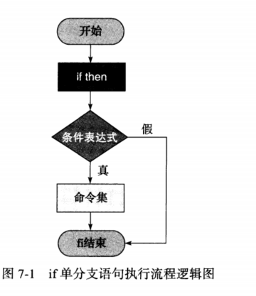
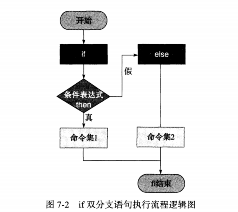
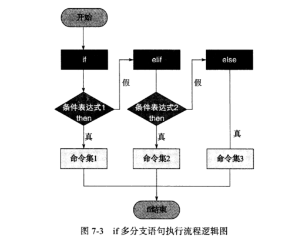

# 7.1 if条件语句


## 7.1.1 if 条件语句语法


### （1）单分支结构



> 第一种语法

```shell
if <条件表达式>
  then
    指令
fi
```

> 第二种语法

```shell
if <条件表达式>;then
  指令
fi
```


两种其实是一种结构，只是将then做了换行处理。


### （2）双分支结构



```shell
if <条件表达式>
  then
	指令集 1
else
    指令集 2
fi
```


之前的测试表达式  `[ -f "$file1" ]  && echo 1 || echo 0  ` 转换为if条件表达式 

```shell
if [ -f  "$file1" ]
  then
    echo 1
else
	echo 0
fi
```


### （3）多分支结构




```shell
if <条件表达式>
  then
    指令 1
elif <条件表达式>
  then
    指令 2
else
    指令 3
fi
# 可以加多个elif
```


> 提示：
>
> 1）多个elif写法，每个之后都要跟一个then。
>
> 2）最后结尾的else没有then。


## 7.1.2 if条件语句多种条件表达式语法


### （1）test条件表达式

```shell
if test 表达式
  then
    指令
fi
```

### （2）[]条件表达式

```shell
if [ 字符串或者算数表达式 ]
  then
    指令
fi
```

### （3）[[]]条件表达式

```shell
if [[ 字符串表达式 ]]
  then
    指令
fi
```


### （4）(())条件表达式

```shell
if ((算数表达式))
  then
    指令
fi
```


### （5）命令表达式

```shell
if 命令
  then
    指令
fi
```


> 实际工作中，选择一种即可，常用的 []


## 7.1.3 单只条件语句实践


#### 7-1 把测试语句换成if 

```shell
# [ -f /etc/hosts ] && echo  1

if [ -f /etc/hosts ];then
  echo 1 
fi
```


```shell
# [[ -f /etc/hosts ]] && echo  1

if [[ -f /etc/hosts ]];then
  echo 1
fi
```


```shell
# test -f /etc/hosts  && echo  1

if test -f /etc/hosts
  then
    echo 1
fi
```


#### 7-2  开发Shell脚本判断系统内存大小，如果低于100M，就邮件报备给系统管理员，并加入定时任务，没三分钟执行一次。

1) 获取文件大小

