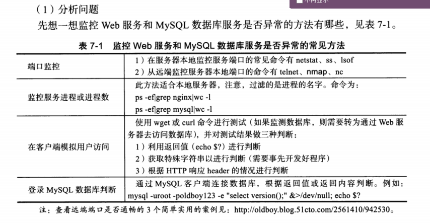

# 7.2 if 条件语句企业案例精讲


## 7.2.1 监控web和数据库案例


#### 7-4  if 监控nginx web或者mysql数据库是否正常运行

##### （1）分析问题



##### （2）监控mysql数据库异常

- 查看进程

```shell
[root@cdyf150 ~]# netstat -lntup| grep mysql
tcp6       0      0 :::3306                 :::*                    LISTEN      1586/mysqld 
```

- 查看服务是否正常

```shell
[root@cdyf150 ~]# netstat -lnt|grep 3306|awk -F "[ :]+" '{print $4}'
3306
```

```shell
[root@cdyf150 ~]# netstat -lntup| grep mysql|wc l
wc: l: No such file or directory
[root@cdyf150 ~]# netstat -lntup| grep mysql|wc -l
1
[root@cdyf150 ~]# netstat -lntup| grep 3306|wc -l
1
[root@cdyf150 ~]# lsof -i tcp:3306|wc -l
1
```


- 监控端口  telnet nmap nc 

`yum install -y   telnet nmap nc`

```shell
[root@cdyf138 7]# nmap 192.168.8.150 -p 3306|grep open|wc -l
1
[root@cdyf138 7]# echo -e "\n"|telnet 192.168.8.150 3306 2>/dev/null|grep Connected|wc -l
1
[root@cdyf138 7]# nc -w 2 192.168.8.150 3306 $>/dev/null
[root@cdyf150 ~]# ps -ef|grep mysql|grep -v grep|wc -l
1
```

- 监控网站

```shell
[root@cdyf138 7]# wget --spider --timeout=10 --tries=2 www.baidu.com
Spider mode enabled. Check if remote file exists.
--2021-01-26 20:19:48--  http://www.baidu.com/
Resolving www.baidu.com (www.baidu.com)... 14.215.177.39, 14.215.177.38
Connecting to www.baidu.com (www.baidu.com)|14.215.177.39|:80... connected.
HTTP request sent, awaiting response... 200 OK
Length: 2381 (2.3K) [text/html]
Remote file exists and could contain further links,
but recursion is disabled -- not retrieving.
```

```shell
[root@cdyf138 7]# curl -s -o /dev/null http://www.baidu.com
[root@cdyf138 7]# echo $?
0
```

```shell
[root@cdyf138 7]# wget -T 10 -q --spider http://www.baidu.com  >&/dev/null
[root@cdyf138 7]# echo $?
0
```


##### (3)开发mysql监控脚本

- 脚本1

```shell
echo " monitor msyql-1----------"
if [ `netstat -lnt|grep 3306|awk -F "[ :]+" '{print $4}'` -eq 3306 ];then
  echo "Service mysql is up"
  exit 0
else
  echo "Service mysql is down"
  exit 1
fi
```


##### (4) 监控nginx web

```shell
[root@cdyf137 /]# curl http://192.168.8.137
<html>
<head><title>Index of /</title></head>
<body>
<h1>Index of /</h1><hr><pre><a href="../">../</a>
<a href="docker/">docker/</a>                                            20-Jan-2021 14:25                   -
<a href="elastic/">elastic/</a>                                           20-Jan-2021 14:25                   -
<a href="jdk/">jdk/</a>                                               20-Jan-2021 14:25                   -
<a href="maven/">maven/</a>                                             20-Jan-2021 14:26                   -
<a href="nodejs/">nodejs/</a>                                            20-Jan-2021 14:26                   -
<a href="rabbitmq/">rabbitmq/</a>                                          20-Jan-2021 14:26                   -
<a href="redis/">redis/</a>                                             20-Jan-2021 14:26                   -
<a href="tomcat/">tomcat/</a>                                            20-Jan-2021 14:26                   -
</pre><hr></body>
</html>
```


- 命令行

```shell
[root@cdyf137 /]# ps -ef |grep nginx|grep -v grep|wc -l
5

```

- 脚本

```shell
#!/bin/bash
echo http method 1-----------------
if [[ `netstat -lnt|grep 80|awk -F "[ :]+" '{print $5}'` -eq 80 ]];then
  echo "Nginx is running"
else
  echo "Nginx is stoped"
  systemctl start nginx
fi
```


## 7.2.2 比较大小的经典案例


#### 7-5 使用if比较两个证书大小，使用传参，对传入参数是否为整数进行判断

```shell
#!/bin/bash
# Author: wuzb
# Email: wuzhibin05@163.com
# Date: 2021/01/26 20:47:14
# Version: 1.0
# Description: compare

a=$1
b=$2

if [ $# -ne 2 ];then
  echo "USAGE $0 arg1 arg2"
  exit 2
fi

expr $a + 1 &>/dev/null
RETAL1=$?
expr $b + 1 &>/dev/null
RETAL2=$?

if [ $RETAL1 -ne 0 -a $RETAL2 -ne 0 ];then
  echo "please input two num again."
  exit 1
fi

if [ $a -gt $b ]
  then
    echo " $a is greater than $b."
    exit 0
fi
if [ $a -lt $b ] 
  then
    echo " $a is less than $b."
    exit 0
fi
if [ $a -eq $b ]
  then
    echo " $a is equal $b."
    exit 0
fi
```


## 7.2.3 判断字符串是否为数字的多种思路

#### 7-6 判断字符串是否为数字的多种思路

> 思路：删除一个字符串中所有的数字，看字符串的长度是否为0，如果不为0，则说明不是整数。

- sed 正则表达式

```shell
[cdyf@cdyf138 7]$ [ -n "`echo oldboy123|sed 's/[0-9]//g'`" ] && echo char || echo int
char
[cdyf@cdyf138 7]$ [ -n "`echo oldboy123|sed 's/[0-9]//g'`" ] && echo char || echo int
char
[cdyf@cdyf138 7]$ [ -n "`echo 123|sed 's/[0-9]//g'`" ] && echo char || echo int
int
[cdyf@cdyf138 7]$ [ -z "`echo 123|sed 's/[0-9]//g'`" ] && echo char || echo int
char
[cdyf@cdyf138 7]$ [ -z "`echo oldgirl123|sed 's/[0-9]//g'`" ] && echo char || echo int
int
[cdyf@cdyf138 7]$ [ -z "`echo oldgirl123|sed 's/[0-9]//g'`" ] && echo int || echo char
char
```


- 使用变量替换字符串

```shell
[cdyf@cdyf138 7]$ num=oldboy521
[cdyf@cdyf138 7]$ [ -z "`echo "${num//[0-9]/}"`" ] && echo int || echo char
char
[cdyf@cdyf138 7]$ echo ${num//[0-9]/}
oldboy
[cdyf@cdyf138 7]$ num=521
[cdyf@cdyf138 7]$ [ -z "`echo "${num//[0-9]/}"`" ] && echo int || echo char
int
```

- 通过expr计算判断

```shell
[cdyf@cdyf138 7]$ expr 0 + 1 &>/dev/null
[cdyf@cdyf138 7]$ echo $?
0
[cdyf@cdyf138 7]$ expr abc + 1 &>/dev/null
[cdyf@cdyf138 7]$ echo $?
2
[cdyf@cdyf138 7]$ expr 123 + 1 &>/dev/null
[cdyf@cdyf138 7]$ echo $?
0
```

- **利用 `=~`符号判断**[TODO]

```shell
[cdyf@cdyf138 7]$ [[ oldboy123 =~ ^[0-9]+$  ]] && echo int || echo  char
char
[cdyf@cdyf138 7]$ [[ 123 =~ ^[0-9]+$  ]] && echo int || echo  char
int

```

- 利用bc判断（有bug，不推荐）

```shell
[cdyf@cdyf138 7]$ echo oldboy|bc
0
[cdyf@cdyf138 7]$ echo 123|bc
123
[cdyf@cdyf138 7]$ echo oldboy123|bc
0
[cdyf@cdyf138 7]$ echo 123 oldboy|bc
(standard_in) 1: syntax error

```


## 7.2.4 判断字符串长度是否为0的多种思路

#### 7-7 实现多种方法判断字符串长度是否为0

（1）使用字符串方法 `-z `和`-n`

```shell
[cdyf@cdyf138 7]$ [ -n "oldboy"  ] && echo 1 || echo 0
1
[cdyf@cdyf138 7]$ [ -z "oldboy"  ] && echo 1 || echo 0
0
```


（2） 使用expr length计算长度

```shell
[cdyf@cdyf138 7]$ [ `expr length "oldboy"` -eq 0 ] && echo 1 || echo 0
0
```


（3）利用变量子串判断

```shell
[cdyf@cdyf138 7]$ [ ${#char} -eq 0 ] && echo 1 || echo 0
0
```


(4) 使用`wc`的-L统计计算

```shell 
[ `echo "oldboy"|wc -l` -eq 0 ] && echo 1 || echo 0
```


(5)使用 `awk` `length`函数语法

```shell
[cdyf@cdyf138 7]$ [ `echo oldboy|awk '{print length}'` -eq 0 ] && echo 1 || echo 0
0
```


## 7.2.5 更多生产实战案例


#### 7-8  监控memcached服务是否正常，模拟用户（web客户端）检测。

- telnet检测

```shell
[root@cdyf138 ~]# echo -e "\n"|telnet 192.168.8.138 11211 2>/dev/null|grep Connected|wc -l
1

```

- nc检测

```shell
nc -w 1 192.168.8.138 11211 &>/dev/null
echo $?
```

- 参考答案

```shell
#!/bin/bash

printf "del key\r\n"|nc 127.0.0.1 11211 &>/dev/null
printf "se key 0 0  10 \r\nold1234\r\n"|nc 127.0.0.1 11211 &>/dev/null
McValues=`printf "get key\r\n"|nc 127.0.0.1 11211 | grep oldboy1234|wc -l`

if [ $McValues -eq 1 ]
  then
    echo "memcached status is ok"
else
    echo "memecached status is bad"
fi
```


#### 7-9 开发rsync服务启动脚本

rsync是运维场景中常用的数据同步软件，要完成rsync服务的方法，即`/etc/init.d/rsyncd {start|stop|restart}`。使用if条件判断来实现。

（1）分析问题，熟悉rsync服务配置及rsync服务启动停止。

（2）需要使用脚本传参进行判断，然后执行对应的命令。

##### 第一步：准备 

```shell
[root@cdyf139 koca-guojun]# rpm -qa rsync
rsync-3.1.2-10.el7.x86_64
[root@cdyf139 koca-guojun]# touch /etc/rsyncd.conf
[root@cdyf139 koca-guojun]# rsync --daemon
[root@cdyf139 koca-guojun]# netstat -lnt|grep 873
tcp        0      0 0.0.0.0:873             0.0.0.0:*               LISTEN     
tcp6       0      0 :::873 
```

##### 第二步：实现启动停止及端口检车方法

```shell
[root@cdyf139 koca-guojun]# pkill rsync
[root@cdyf139 koca-guojun]# netstat -lnt|grep 873
[root@cdyf139 koca-guojun]# rsync --daemon
[root@cdyf139 koca-guojun]# netstat -lnt|grep 873
tcp        0      0 0.0.0.0:873             0.0.0.0:*               LISTEN     
tcp6       0      0 :::873                  :::*                    LISTEN  
```

##### 第三步： 判断服务是否启动的方法

> 常规的方法有检测端口及进程是否存在，还可以当服务启动时候，创建一个锁文件，服务停止则删除。


##### 第四步：开发脚本

```shell
#!/bin/bash

if [ $# -ne 1 ];then
  echo $"USAGE $0 {start|stop|restart}"
  exit 1
fi
if [  "$1" = "start" ]
  then
    rsync --daemon
    sleep 2
  if [ `netstat -lnutp|grep rsync|wc -l` -ge 1 ]
    then
      echo "rsyncd is started"
      exit 0
  fi
elif [  "$1" = "stop" ]
  then
    pkill rsync &>/dev/null
    sleep 2
    if [ `netstat -lnutp|grep rsync|wc -l` -eq 0 ]
      then
        echo "rsyncd is stoped"
        exit 0
    fi
elif [  "$1" = "restart" ]
  then
    pkill rsync
    sleep 1
    killpro=`netstat -lnutp|grep rsync|wc -l`
    rsync --daemon
    sleep 1
    startpro=`netstat -lnutp|grep rsync|wc -l`
    if [ $killpro -eq 0 -a $startpro -ge 1 ];then  
      echo "rsync is started"
      exit 0
    fi
else
  echo $"USAGE $0 {start|stop|restart}"
  exit 1
fi

```


#### 7-10 使用上述开发好的脚本，通过chkconfig来管理开机启动

> chconfig是系统用来管理脚本开机启动的命令，但是需要支持长从傅工管理才行，具体方法，在解释器之后加入两行内容
>
> `# chkconfig: 2345 20 80`
>
> `# description: Saves and restores system entropy pool`
>
> 第一行说需要chkconfig管理，2345是linux的运行级别，表示默认在2345级别为启动状态，20是脚本开始启动顺序，80 是脚本停止顺序。这两个数字都不能超过99，应用服务一般要靠后启动为佳，越早停止越好。


```shell
#!/bin/bash

# chkconfig: 2345 20 80

# description: Saves and restores system entropy pool
if [ $# -ne 1 ];then
  echo $"USAGE $0 {start|stop|restart}"
  exit 1
fi
if [  "$1" = "start" ]
  then
    rsync --daemon
    sleep 2
  if [ `netstat -lnutp|grep rsync|wc -l` -ge 1 ]
    then
      echo "rsyncd is started"
      exit 0
  fi
elif [  "$1" = "stop" ]
  then
    pkill rsync &>/dev/null
    sleep 2
    if [ `netstat -lnutp|grep rsync|wc -l` -eq 0 ]
      then
        echo "rsyncd is stoped"
        exit 0
    fi
elif [  "$1" = "restart" ]
  then
    pkill rsync
    sleep 1
    killpro=`netstat -lnutp|grep rsync|wc -l`
    rsync --daemon
    sleep 1
    startpro=`netstat -lnutp|grep rsync|wc -l`
    if [ $killpro -eq 0 -a $startpro -ge 1 ];then  
      echo "rsync is started"
      exit 0
    fi
else
  echo $"USAGE $0 {start|stop|restart}"
  exit 1
fi
```


- 把服务的脚本`rsyncd`放到/etc/init.d下面

```shell
[root@cdyf139 opt]# systemctl list-dependencies rsryncd
rsryncd.service
[root@cdyf139 opt]# chkconfig --add rsyncd
[root@cdyf139 opt]# systemctl list-dependencies rsrync
rsrync.service
```

