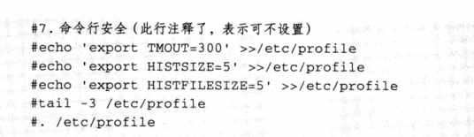

# 8.6 利用shell函数开发一键优化系统脚本


### 8-7 编写shell开发linux系统一键优化脚本

如何优化linux系统


#### 1）先寻找原始脚本，思考如何优化linux系统，并写出来。

这里仅给出一些基础的优化项目，提供基本的优化思路和方法。

- [x] 安装系统时精简安装包（最小化安装）
- [x] 配置国内的高速yum源
- [x] 禁用开机不需要启动的服务
- [x] 优化系统内核参数/etc/sysctl.conf
- [x] 增加系统文件描述符，堆栈等配置
- [x] 禁止root用户远程登录，修改ssh端口为特殊端口，禁止dns及空密码
- [x] 有外网ip的机器要开启，配置防火墙，仅对外开启需要提供服务的端口，配置或者关闭selinux
- [x] 清除无用的默认系统账户或者组（非必须）（添加运维成员用户）
- [x] 锁定敏感文件，如/etc/passwd(非必须)
- [x] 配置服务器与互联网时间同步
- [x] 初始化用户，并配置sudo对普通用户的权限控制
- [x] 修改系统字符集
- [x] 补装系统软件及升级系统到最新。

#### 2）将剧本拍戏的信息

##### （1）更改yum源头

```shell
mv /etc/yum.repos.d/CentOS-Base.repo /etc/yum.repos.d/CentOS-Base.repo.backup
wget -O /etc/yum.repos.d/CentOS-Base.repo http://mirrors.aliyun.com/repo/Centos-7.repo
```

##### （2）关闭selinux

```shell
sed -i 's/SELINUX=enforcing/SELINUX=disabled/' /etc/selinux/config
grep SELINUX=disabled /etc/selinux/config
setenforce 0
getenforce
```

##### （3）关闭iptables

```shell
systemctl stop iptables # twice ensure to stop
systemctl stop iptables
systemctl disable iptables
```

##### （4）精简开机启动

```tex
todo
```

##### （5）授权普通用户可以sudo

```shell
useradd cdyf
echo cdyf|passwd --stdin cdyf
\cp /etc/sudoers /etc/sudoers.ori
echo "cdyf ALL=(All) NOPASSWD: ALL " >>/etc/sudoers
tail -1 /etc/sudoers
visudo -c
```

##### （6）中文字符集

```shell
cp /etc/locale.conf /etc/locale.conf.ori
echo 'LANG="zh_CN.UTF-8"' >/etc/locale.conf
source /etc/locale.conf
echo $LANG
```

##### （7）时间同步

```shell
echo '#time sync by oldboy at 2021-1-30' >>/var/spool/cron/root
echo '*/5 * * * * /usr/sbin/ntpupdate time.nist.gov >/dev/null 2>&1' >>/var/spool/cron/root
crontab -l
```

##### （8）命令行安全



##### (9) 加大文件描述

```shell
echo '* - nofile 65535'>>/etc/security/limits.conf
tail -1 /etc/security/limits.conf
```

##### (10)内核优化

```shell
net.ipv4.tcp_fin_timeout = 2
net.ipv4.tcp_tw_reuse = 1
net.ipv4.tcp_tw_recycle = 1
net.ipv4.tcp_syncookies = 1
net.ipv4.tcp_keepalive_time = 600
net.ipv4.ip_local_port_range = 4000    65000
net.ipv4.tcp_max_syn_backlog = 16384
net.ipv4.tcp_max_tw_buckets = 36000
net.ipv4.route.gc_timeout = 100
net.ipv4.tcp_syn_retries = 1
net.ipv4.tcp_synack_retries = 1
net.core.somaxconn = 16384
net.core.netdev_max_backlog = 16384
net.ipv4.tcp_max_orphans = 16384
net.nf_conntrack_max = 25000000
net.netfilter.nf_conntrack_max = 25000000
net.netfilter.nf_conntrack_tcp_timeout_established = 180
net.netfilter.nf_conntrack_tcp_timeout_time_wait = 120
net.netfilter.nf_conntrack_tcp_timeout_close_wait = 60
net.netfilter.nf_conntrack_tcp_timeout_fin_wait = 120
```

```shell
sysctl -p
yum update -y
yum install lrzsz nmap tree dos2unix nc -y
```


**示例代码**

```shell
#!/bin/bash
# Author: wuzb
# Email: wuzhibin05@163.com
# Date: 2021/02/01 08:44:17
# Version: 1.0
# Description: system optimizing

export PATH=$PATH:/bin:/sbin:/usr/sbin

# check user is root or not.
if [ $UID -ne 0 ];then
    echo "you master run script with root."
    exit 1
fi

# define cmd var
SYSTEMCTL=`which systemctl`

function modify_yum()
{
    if [  -e /etc/yum.repos.d/CentOS-Base.repo ];then
        mv /etc/yum.repos.d/CentOS-Base.repo /etc/yum.repos.d/CentOS-Base.repo.backup
        wget -O /etc/yum.repos.d/CentOS-Base.repo http://mirrors.aliyun.com/repo/Centos-7.repo
    fi
}

function close_selinux()
{
    if [ -f /etc/selinux/config ];then
        sed -i 's/SELINUX=enforcing/SELINUX=disabled/' /etc/selinux/config
        #grep SELINUX=disabled /etc/selinux/config
        setenforce 0
        #getenforce
    fi
}

function close_iptables()
{
    systemctl stop iptables # twice ensure to stop
    systemctl stop iptables
    systemctl disable iptables
}

function least_service()
{
    echo "TODO"
}

function add_user()
{
    if [ `grep -w cdyf /etc/passwd|wc -l` -lt 1 ];then
        useradd cdyf
        echo cdyf|passwd --stdin cdyf
        \cp /etc/sudoers /etc/sudoers.ori
        echo "cdyf ALL=(All) NOPASSWD: ALL " >>/etc/sudoers
        tail -1 /etc/sudoers
        visudo -c  &>/dev/null
    fi
}

function set_lang()
{
    cp /etc/locale.conf /etc/locale.conf.ori
    echo 'LANG="zh_CN.UTF-8"' >/etc/locale.conf
    source /etc/locale.conf
    echo $LANG
}

function com_line_set(){
    #7.command set.
    if [ `egrep "TMOUT|HISTSIZE|HISTFILESIZE" /etc/profile|wc -l` -ge 3  ]
      then
        echo 'export TMOUT=300' >>/etc/profile
        echo 'export HISTSIZE=5' >>/etc/profile
        echo 'export HISTFILESIZE=5' >>/etc/profile
        . /etc/profile
    fi
}

function time_sync()
{
    echo '#time sync by oldboy at 2021-1-30' >>/var/spool/cron/root
    echo '*/5 * * * * /usr/sbin/ntpupdate time.nist.gov >/dev/null 2>&1' >>/var/spool/cron/root
    crontab -l
}

function open_file_set()
{
    if [ `grep 65535 /etc/security/limits.conf|wc -l` -lt 1 ];then
        echo '* - nofile 65535'>>/etc/security/limits.conf
        tail -1 /etc/security/limits.conf
    fi
}

function set_kernel()
{
    if [ `grep kernel_flag /etc/sysctl.conf|wc -l` -lt 1 ]
      then
        cat >>/etc/sysctl.conf<<EOF
        #kernel_flag
        net.ipv4.tcp_fin_timeout = 2
        net.ipv4.tcp_tw_reuse = 1
        net.ipv4.tcp_tw_recycle = 1
        net.ipv4.tcp_syncookies = 1
        net.ipv4.tcp_keepalive_time = 600
        net.ipv4.ip_local_port_range = 4000    65000
        net.ipv4.tcp_max_syn_backlog = 16384
        net.ipv4.tcp_max_tw_buckets = 36000
        net.ipv4.route.gc_timeout = 100
        net.ipv4.tcp_syn_retries = 1
        net.ipv4.tcp_synack_retries = 1
        net.core.somaxconn = 16384
        net.core.netdev_max_backlog = 16384
        net.ipv4.tcp_max_orphans = 16384
        net.nf_conntrack_max = 25000000
        net.netfilter.nf_conntrack_max = 25000000
        net.netfilter.nf_conntrack_tcp_timeout_established = 180
        net.netfilter.nf_conntrack_tcp_timeout_time_wait = 120
        net.netfilter.nf_conntrack_tcp_timeout_close_wait = 60
        net.netfilter.nf_conntrack_tcp_timeout_fin_wait = 120
EOF
        sysctl -p
    fi
}

function init_ssh(){
    \cp /etc/ssh/sshd_config /etc/ssh/sshd_config.`date +"%Y-%m-%d_%H-%M-%S"`
    #sed -i 's%#Port 22%Port 52113%' /etc/ssh/sshd_config
    sed -i 's%#PermitRootLogin yes%PermitRootLogin no%' /etc/ssh/sshd_config
    sed -i 's%#PermitEmptyPasswords no%PermitEmptyPasswords no%' /etc/ssh/sshd_config
    sed -i 's%#UseDNS yes%UseDNS no%' /etc/ssh/sshd_config
    /etc/init.d/sshd reload &>/dev/null
}

function update_linux(){
    if [ `rpm -qa lrzsz nmap tree dos2unix nc|wc -l` -le 3 ]
      then
        yum install lrzsz nmap tree dos2unix nc -y
        #yum update -y
    fi
}

main(){
    modify_yum
    close_selinux
    close_iptables
    least_service
    add_user
    set_lang
    time_sync
    com_line_set
    open_file_set
    set_kernel
    init_ssh
    update_linux
}
main
```

