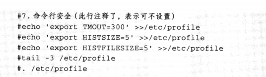

# 8.6 利用shell函数开发一键优化系统脚本


### 8-7 编写shell开发linux系统一键优化脚本

如何优化linux系统


#### 1）先寻找原始脚本，思考如何优化linux系统，并写出来。

这里仅给出一些基础的优化项目，提供基本的优化思路和方法。

- [x] 安装系统时精简安装包（最小化安装）
- [x] 配置国内的高速yum源
- [x] 禁用开机不需要启动的服务
- [x] 优化系统内核参数/etc/sysctl.conf
- [x] 增加系统文件描述符，堆栈等配置
- [x] 禁止root用户远程登录，修改ssh端口为特殊端口，禁止dns及空密码
- [x] 有外网ip的机器要开启，配置防火墙，仅对外开启需要提供服务的端口，配置或者关闭selinux
- [x] 清除无用的默认系统账户或者组（非必须）（添加运维成员用户）
- [x] 锁定敏感文件，如/etc/passwd(非必须)
- [x] 配置服务器与互联网时间同步
- [x] 初始化用户，并配置sudo对普通用户的权限控制
- [x] 修改系统字符集
- [x] 补装系统软件及升级系统到最新。

#### 2）将剧本拍戏的信息

##### （1）更改yum源头

```shell
mv /etc/yum.repos.d/CentOS-Base.repo /etc/yum.repos.d/CentOS-Base.repo.backup
wget -O /etc/yum.repos.d/CentOS-Base.repo http://mirrors.aliyun.com/repo/Centos-7.repo
```

##### （2）关闭selinux

```shell
sed -i 's/SELINUX=enforcing/SELINUX=disabled/' /etc/selinux/config
grep SELINUX=disabled /etc/selinux/config
setenforce 0
getenforce
```

##### （3）关闭iptables

```shell
systemctl stop iptables # twice ensure to stop
systemctl stop iptables
systemctl disable iptables
```

##### （4）精简开机启动

```tex
todo
```

##### （5）授权普通用户可以sudo

```shell
useradd cdyf
echo cdyf|passwd --stdin cdyf
\cp /etc/sudoers /etc/sudoers.ori
echo "cdyf ALL=(All) NOPASSWD: ALL " >>/etc/sudoers
tail -1 /etc/sudoers
visudo -c
```

##### （6）中文字符集

```shell
cp /etc/locale.conf /etc/locale.conf.ori
echo 'LANG="zh_CN.UTF-8"' >/etc/locale.conf
source /etc/locale.conf
echo $LANG
```

##### （7）时间同步

```shell
echo '#time sync by oldboy at 2021-1-30' >>/var/spool/cron/root
echo '*/5 * * * * /usr/sbin/ntpupdate time.nist.gov >/dev/null 2>&1' >>/var/spool/cron/root
crontab -l
```

##### （8）命令行安全



##### (9) 加大文件描述

```shell
echo '* - nofile 65535'>>/etc/security/limits.conf
tail -1 /etc/security/limits.conf
```

##### (10)内核优化

```shell
cat >>/etc/sysctl.d/99-sysctl.conf<<EOF
#关闭ipv6
net.ipv6.conf.all.disable_ipv6 = 1
net.ipv6.conf.default.disable_ipv6 = 1

# 避免放大攻击
net.ipv4.icmp_echo_ignore_broadcasts = 1

# 开启恶意icmp错误消息保护
net.ipv4.icmp_ignore_bogus_error_responses = 1

# 关闭路由转发
net.ipv4.ip_forward = 0
net.ipv4.conf.all.send_redirects = 0
net.ipv4.conf.default.send_redirects = 0

#开启反向路径过滤
net.ipv4.conf.all.rp_filter = 1
net.ipv4.conf.default.rp_filter = 1

关闭sysrq功能
kernel.sysrq = 0

#core文件名中添加pid作为扩展名
kernel.core_uses_pid = 1
net.ipv4.tcp_syncookies = 1

#修改消息队列长度
kernel.msgmnb = 65536
kernel.msgmax = 65536

#设置最大内存共享段大小bytes
kernel.shmmax = 68719476736
kernel.shmall = 4294967296

#timewait的数量，默认180000
net.ipv4.tcp_max_tw_buckets = 6000
net.ipv4.tcp_sack = 1
net.ipv4.tcp_window_scaling = 1
net.ipv4.tcp_rmem = 4096        87380   4194304
net.ipv4.tcp_wmem = 4096        16384   4194304
net.core.wmem_default = 8388608
net.core.rmem_default = 8388608
net.core.rmem_max = 16777216
net.core.wmem_max = 16777216
net.core.netdev_max_backlog = 262144


#限制仅仅是为了防止简单的DoS 攻击
net.ipv4.tcp_max_orphans = 3276800

#未收到客户端确认信息的连接请求的最大值
net.ipv4.tcp_max_syn_backlog = 262144
net.ipv4.tcp_timestamps = 0

#内核放弃建立连接之前发送SYNACK 包的数量
net.ipv4.tcp_synack_retries = 1

#内核放弃建立连接之前发送SYN 包的数量
net.ipv4.tcp_syn_retries = 1

#启用timewait 快速回收
net.ipv4.tcp_tw_recycle = 1

#开启重用。允许将TIME-WAIT sockets 重新用于新的TCP连接
net.ipv4.tcp_tw_reuse = 1
net.ipv4.tcp_mem = 94500000 915000000 927000000
net.ipv4.tcp_fin_timeout = 1

#当keepalive 起用的时候，TCP 发送keepalive 消息的频度。缺省是2 小时
net.ipv4.tcp_keepalive_time = 30

#允许系统打开的端口范围
net.ipv4.ip_local_port_range = 1024    65000

#修改防火墙表大小，默认65536
net.netfilter.nf_conntrack_max=655350
net.netfilter.nf_conntrack_tcp_timeout_established=1200

# 确保无人能修改路由表
net.ipv4.conf.all.accept_redirects = 0
net.ipv4.conf.default.accept_redirects = 0
net.ipv4.conf.all.secure_redirects = 0
net.ipv4.conf.default.secure_redirects = 0
EOF
```

```shell
sysctl -p
yum update -y
yum install lrzsz nmap tree dos2unix nc -y
```

