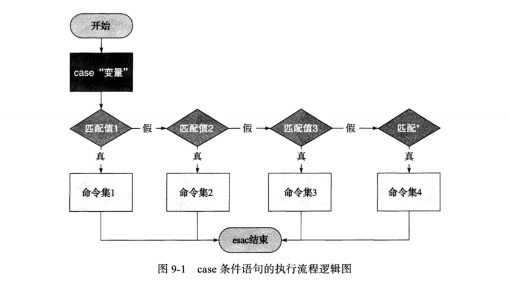

# 9.1 case条件语句的语法

- 语法格式如下

```shell
case "变量" in
	值 1）
		指令 1 ...
		;;
	值 2）
	    指令 2...
	    ;;
	*）
		指令 3...
esac   
```


> 说明
>
> - 当变量值等于1 的时候，执行指令1
> - 等于2的时候执行指令2，以此类推
> - 如果都不符合执行 `*)`后面的指令
> - 注意不同行内容的缩进距离


