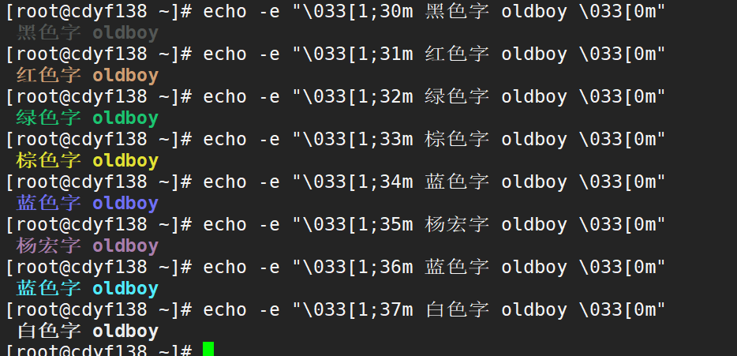

# 9.3 实践：给输出字符串加颜色


## 9.3.1 给输出字符串加颜色的基本知识


> echo -e 参数: 给不同字符加上颜色


#### 9.3 给内容加上不同颜色

```shell
[root@cdyf138 ~]# echo -e "\033[1;30m 黑色字 oldboy \033[0m"
 黑色字 oldboy 
[root@cdyf138 ~]# echo -e "\033[1;31m 红色字 oldboy \033[0m"
 红色字 oldboy 
[root@cdyf138 ~]# echo -e "\033[1;32m 绿色字 oldboy \033[0m"
 绿色字 oldboy 
[root@cdyf138 ~]# echo -e "\033[1;33m 棕色字 oldboy \033[0m"
 棕色字 oldboy 
[root@cdyf138 ~]# echo -e "\033[1;34m 蓝色字 oldboy \033[0m"
 蓝色字 oldboy 
[root@cdyf138 ~]# echo -e "\033[1;35m 杨宏字 oldboy \033[0m"
 杨宏字 oldboy 
[root@cdyf138 ~]# echo -e "\033[1;36m 蓝色字 oldboy \033[0m"
 蓝色字 oldboy 
[root@cdyf138 ~]# echo -e "\033[1;37m 白色字 oldboy \033[0m"
 白色字 oldboy
```





#### 

## 9.3.2  结合case语句给输出的字符串加颜色

#### 要求结合case语句

#### 示例 9-5 

1. 传入两个参数，第一个是内容，第二个是颜色

```shell
#!/bin/bash
# Author: wuzb
# Email: wuzhibin05@163.com
# Date: 2021/02/02 08:44:10
# Version: 1.0
# Description: shell conding

RED_COLOR='\E[1;31m'
GREEN_COLOR='\E[1;32m'
YELLOW_COLOR='\E[1;33m'
BLUE_COLOR='\E[1;34m'
RES='\E[0m'

function usage()
{
    echo "USAGE: $0 content {red|yellow|blue|green}"
}


function add_color(){
    case "$2" in
        red|RED)
            echo -e "${RED_COLOR}${1}${RES}"
            ;;
        yellow|YELLOW)
            echo -e "${YELLOW_COLOR}${1}${RES}"
            ;;
        blue|BLUE)
            echo -e "${BLUE_COLOR}${1}${RES}"
            ;;
        green|GREEN)
            echo -e "${GREEN_COLOR}${1}${RES}"
            ;;
        *)
            usage
    esac
}

function main()
{
    add_color $1 $2
}
main $*
```

